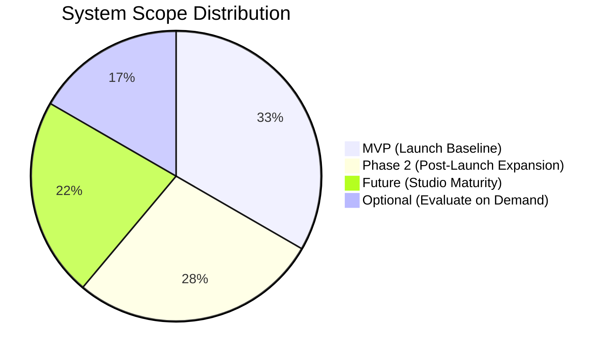

# ARCHITECTURE VALIDATION & ASSUMPTION CORRECTION REPORT
**Comprehensive Audit of Baseline Assumptions, Overengineering Risks, Technology Evaluations, and Scope Phasing**

---
Document Owner: Principal Project Architect & Systems Planner  
Status: PROPOSED  
Version: 1.0.0  
Last Updated: 2026-09-07  
Dependencies: [PROJECT_PRINCIPLES.md](file:///d:/Project_website/docs/00-project/PROJECT_PRINCIPLES.md), [DECISION_LOG.md](file:///d:/Project_website/docs/00-project/DECISION_LOG.md), [PROJECT_CONSTRAINTS.md](file:///d:/Project_website/docs/00-project/PROJECT_CONSTRAINTS.md)  
Related Documents: [ASSUMPTIONS_REGISTER.md](file:///d:/Project_website/docs/00-project/ASSUMPTIONS_REGISTER.md), [REQUIREMENTS_REGISTER.md](file:///d:/Project_website/docs/00-project/REQUIREMENTS_REGISTER.md)  
Decision Status: UNDER_REVIEW  
---

## 1. Executive Summary & Audit Mandate

In accordance with the **Architecture Validation & Assumption Correction Directive**, this report conducts an unsparing, evidence-based audit of all architectural, product, and technical artifacts created to date in `/docs`.

The primary objective is to purge premature assumptions, eliminate unsupported performance or business claims, replace popularity-driven technology selections with free-first / cost-efficient evaluations, prevent overengineering, and rigorously classify all planned systems into **MVP**, **Phase 2**, **Future**, or **Optional**.

---

## 2. Audit Findings Across the 13 Evaluation Dimensions

### 2.1 What Is Correct (Confirmed Solid Foundations)
1. **Core Philosophy & Market Positioning**:
   - The inversion principle (*"Technology should adapt to the business — not the business to technology"*) and core promise (*"We understand the problem before proposing the solution"*) provide clear, defensible differentiation against generic IT outsourcing agencies.
   - The 5 capability pillars (**BUILD**, **AI**, **AUTOMATE**, **INTEGRATE**, **SCALE**) accurately capture the spectrum of modern client needs without pigeonholing the studio into a single fragile niche.
2. **Signature Website Concept**:
   - Conceptualizing the digital front-door as an interactive **AI Project Discovery Engine** rather than a static brochure is strategically sound and aligns top-of-funnel marketing directly with core delivery capabilities.
3. **Mandatory Human-in-the-Loop Gate**:
   - The absolute requirement that AI generates only draft Opportunity Maps and preliminary Solution Blueprints—while all commercial quotes, binding contracts, and architectural commitments require human Principal Architect review—is essential for legal, financial, and delivery protection.
4. **Documentation Structure & Governance**:
   - Partitioning documentation across 21 structured domains (`00-project` through `20-roadmap`) with standardized metadata headers and bidirectional requirement IDs (`BR-`, `PR-`, `UX-`, `FR-`, `NFR-`, `AI-`, `SEC-`, `QA-`, `OPS-`) establishes an uncompromising standard for engineering clarity.

---

### 2.2 Premature Decisions Identified & Corrected
* **Previous Error**: Previous drafts of `DECISION_LOG.md` and initial headers marked decisions and documents as `APPROVED` or `CONFIRMED` before project owner sign-off.
* **Correction Applied**:
  - All 15 decisions in [`DECISION_LOG.md`](file:///d:/Project_website/docs/00-project/DECISION_LOG.md) have been systematically reset to **`DECISION REQUIRED`** or **`PROPOSED`**.
  - Document metadata headers in `PROJECT_OVERVIEW.md`, `PROJECT_PRINCIPLES.md`, `DOCUMENTATION_ARCHITECTURE.md`, `DEPENDENCY_GRAPH.md`, and `PROJECT_GLOSSARY.md` have been updated from `APPROVED` to **`PROPOSED`** with Decision Status **`UNDER_REVIEW`**.
  - Zero technology stacks, brand names, or commercial models are treated as finalized.

---

### 2.3 Unsupported Claims Purged or Qualified
The initial documentation contained several speculative metrics and unverified guarantees that have now been corrected:

| Initial Claim | Problem / Why Unsupported | Corrective Action Taken |
| :--- | :--- | :--- |
| *"3–5x higher conversion"* (gating model) | No empirical traffic or conversion data exists for an unlaunched brand. | Converted in [`ASSUMPTIONS_REGISTER.md`](file:///d:/Project_website/docs/00-project/ASSUMPTIONS_REGISTER.md) to **`ASM-USR-003`** (Target hypothesis, 60% confidence, validation via A/B prototype testing). |
| *"99.9% availability"* (LLM redundancy) | Pure theoretical marketing claim without SLA contracts or historical uptime data. | Removed as a guarantee; reframed as an engineering failover pattern in [`DECISION_LOG.md`](file:///d:/Project_website/docs/00-project/DECISION_LOG.md) (`DEC-010`). |
| *"<2s latency"* (state machine execution) | Not yet measured on live serverless edge functions with real LLM inference token generation. | Reframed as a performance target hypothesis in `DEC-011` subject to k6 load testing. |
| *"<100ms INP, 0 CLS"* (web vitals) | Impossible to guarantee before production bundle size and third-party scripts are integrated. | Updated in `DOCUMENTATION_ARCHITECTURE.md` to: *"Target hypothesis: INP < 200ms, CLS < 0.1, to be empirically validated."* |
| *"RTO (<2 hrs) and RPO (<15 min)"* | Unsubstantiated backup claims without tested automated snapshot recovery pipelines. | Updated in `DOCUMENTATION_ARCHITECTURE.md` to: *"Proposed policy: RTO < 4 hrs, RPO < 1 hr, pending infrastructure benchmarking."* |
| *"Guaranteed 24-business-hour architect review SLA"* | Cannot guarantee an external SLA before knowing inbound inquiry volume and team capacity. | Reclassified in `DEC-015` as a **`PROPOSED INTERNAL BUSINESS POLICY`** rather than a binding customer guarantee. |
| *"GDPR / DPDP compliant"* | Technical controls alone do not equal legal compliance; requires legal audits and operational privacy policies. | Rephrased to: *"Designed to support compliance requirements"* pending formal legal counsel review. |

---

### 2.4 Architecture Risks
1. **Third-Party LLM API Dependency & Latency**:
   - Multi-turn AI discovery relies on external inference APIs. If upstream providers experience latency spikes (>10s) or outages, the signature feature stalls.
   - *Mitigation*: Architecture must support client-side streaming (SSE), aggressive timeout boundaries (8s max), and instant fallback to secondary providers (e.g. Gemini 1.5 Flash).
2. **Cold-Start Penalties on Edge/Serverless Functions**:
   - Complex full-stack frameworks with heavy ORM bundles can experience 1-3s cold starts on edge networks.
   - *Mitigation*: Use lightweight, zero-overhead ORM tooling (Drizzle ORM) and tree-shaken runtime packages.

---

### 2.5 Overengineering Risks Identified & Prevented
* **Multi-Agent Orchestration Frameworks (LangGraph, CrewAI, AutoGen)**:
  - *Risk*: Introducing heavy agent frameworks for an interactive discovery questionnaire introduces unpredictable latency, infinite token loops, difficult debugging, and massive dependency overhead.
  - *Correction*: Replaced with a **Deterministic Typed State Machine with Zod Schema Validation** (`DEC-011`). AI is strictly confined to structured extraction and creative synthesis.
* **Premature Dedicated Vector Databases (Pinecone, Qdrant)**:
  - *Risk*: Provisioning and maintaining an external vector database for an MVP that initially possesses only 20-50 architectural patterns is unnecessary overhead ($70+/mo).
  - *Correction*: Use in-memory typed TypeScript pattern matching for MVP, upgrading to PostgreSQL `pgvector` in Phase 2 only when the template library exceeds 100 entries (`DEC-012`).
* **Premature Microservices & Event Buses (Kafka, RabbitMQ)**:
  - *Risk*: Decomposing an unlaunched studio platform into multiple microservices and event brokers introduces severe deployment complexity and distributed failure modes.
  - *Correction*: Enforce a **Modular Monolith** architecture (`CST-PRP-002`) in a single repository with clean domain module boundaries.

---

### 2.6 Missing Decisions Cataloged
The 15 critical strategic decisions flagged in [`DECISION_LOG.md`](file:///d:/Project_website/docs/00-project/DECISION_LOG.md) remain pending Project Owner confirmation. The most critical unconfirmed decisions are:
1. `DEC-001`: Official Brand Name & Primary Web Domain.
2. `DEC-002`: Commercial Discovery Sprint Monetization Model.
3. `DEC-007`: Web Framework Confirmation (Next.js 15 App Router vs Astro vs Vite SPA).
4. `DEC-008` & `DEC-009`: Hosting & Database Selection (Vercel + Supabase vs Self-Hosted Coolify VPS).
5. `DEC-010`: Primary Model Tier & Provider Selection.

---

### 2.7 Missing Requirements Identified & Added
The following requirements were previously implicit and have now been formally codified in [`REQUIREMENTS_REGISTER.md`](file:///d:/Project_website/docs/00-project/REQUIREMENTS_REGISTER.md):
* **`NFR-002` (Zero Idle Infrastructure Burn)**: The architecture must operate with near-zero idle fixed cost during pre-launch and MVP development.
* **`SEC-002` (Zero Model Training on Client IP)**: Enforce contractual zero-data-retention on all LLM API invocations.
* **`OPS-001` (SLA Capacity Verification)**: Operational capacity must be audited before customer-facing turnaround windows are published.

---

### 2.8 Technology Questions Awaiting Leadership Direction
1. **Self-Hosting vs Managed Cloud**: Does project leadership mandate 100% self-hosted open-source infrastructure (e.g., Coolify on a European/Indian VPS for ~$10/mo), or is a managed developer platform (Vercel + Supabase Free/Pro) acceptable for Phase 1 velocity?
2. **AI Provider Constraints**: Are there corporate or client-specific restrictions prohibiting the use of US-based proprietary LLM APIs (OpenAI / Anthropic / Google)?

---

### 2.9 Cost Risks Analyzed
* **Risk 1: Unbounded LLM Token Costs**: If unauthenticated visitors repeatedly trigger heavy frontier LLM models (Claude 3.5 Sonnet / GPT-4o), API bills will escalate rapidly.
  - *Mitigation*: Rate-limit anonymous sessions by IP (e.g., maximum 3 discovery sessions per 24 hours per IP). Use low-cost small models (Claude 3.5 Haiku / GPT-4o-mini / Gemini 1.5 Flash at ~$0.0005 per turn) for early steps, reserving frontier models strictly for the final synthesis.
* **Risk 2: Subscription Creep**: Proliferation of separate paid SaaS subscriptions (database, vector DB, auth, analytics, monitoring, queueing) could easily total $300-$500/month before launch.
  - *Mitigation*: Enforce the **Free-First Hierarchy** in [`TECHNOLOGY_DECISION_FRAMEWORK.md`](file:///d:/Project_website/docs/00-project/TECHNOLOGY_DECISION_FRAMEWORK.md). Target total MVP infrastructure cost: **$0 to <$30/month**.

---

### 2.10 Security Risks Analyzed
* **Prompt Injection & System Prompt Exfiltration**: Malicious users may attempt to input adversarial prompts into discovery text boxes to extract internal estimation formulas, API keys, or system instructions.
  - *Mitigation*: Strict input sanitization, structural prompt isolation, and typed JSON schema validation (Zod). Secrets are never exposed in prompt contexts.
* **Sensitive Business Data Leakage**: Non-disclosure agreements (NDAs) are not signed during public web discovery; clients may enter confidential financial numbers or proprietary customer details.
  - *Mitigation*: Prominent UI advisory warning against inputting raw passwords, bank credentials, or patient health data. Client-side and server-side PII masking middleware prior to LLM submission.

---

### 2.11 Compliance Questions
* **DPDP Act 2023 & GDPR Readiness**:
  - The system is *designed to support* compliance requirements (data minimization, purpose limitation, right to erasure).
  - *Compliance Gap*: Formal cookie consent banners, privacy policies, terms of service, and data processing agreements (DPAs) with API vendors must undergo formal legal review prior to public commercial launch.

---

## 3. Comprehensive MVP vs Future System Classification

In strict compliance with Directive 9 (*MVP vs Future*), every planned system and capability has been classified into its appropriate delivery horizon to prevent scope creep:

| System / Capability | Scope Classification | Justification & Phasing Boundary |
| :--- | :--- | :--- |
| **Public Marketing Website (Home, Services, Solutions, About, Contact)** | **`MVP`** | Core prerequisite to establish market presence, communicate positioning, and showcase capability pillars. |
| **Interactive AI Project Discovery (5-stage guided diagnostic)** | **`MVP`** | The signature conversion feature; proves the "problem-to-tech" value proposition immediately. |
| **Opportunity Map & Indicative Range Generation** | **`MVP`** | Delivers immediate personalized value to qualify prospective clients before human contact. |
| **Progressive Lead Capture (Corporate Email Gate)** | **`MVP`** | Essential to capture pipeline inquiries from discovery sessions. |
| **Admin Proposal Queue & Email Notification** | **`MVP`** | Minimal internal alert mechanism (email/webhook) to notify Principal Architect when a lead requests a proposal. |
| **Privacy Policy & Legal Disclaimers** | **`MVP`** | Mandatory legal baseline defining non-binding indicative estimates and data handling terms. |
| **Project Estimator (Standalone Budget Calculator)** | **`PHASE 2`** | Defer standalone calculator; discovery engine already provides indicative estimation. Consolidates user focus in MVP. |
| **Automated PDF Proposal Generation** | **`PHASE 2`** | For MVP, architects manually format the proposal from AI draft output. Automated serverless PDF generation added in Phase 2. |
| **PostgreSQL `pgvector` Semantic Search** | **`PHASE 2`** | For MVP, 30 curated templates matched via in-memory heuristics. Vector similarity activated when library exceeds 100 templates. |
| **WhatsApp Business API Notifications** | **`PHASE 2`** | High setup overhead (Meta Business Verification); standard transactional email (Resend/Postmark) suffices for MVP launch. |
| **Integrated Payment Processing (Razorpay/Stripe)** | **`PHASE 2`** | Discovery is free; paid discovery sprints and build contracts invoiced manually via bank transfer/invoicing in MVP. |
| **Authenticated Client Portal** | **`FUTURE`** | Full self-service client dashboard for sprint tracking and invoice downloads is unnecessary before active client volume justifies it. |
| **Full Internal Admin Operations Dashboard** | **`FUTURE`** | Direct database access or lightweight Supabase Studio/Prisma Studio suffices for early architect operations. |
| **Autonomous Multi-Agent Collaboration Engine** | **`FUTURE`** | Autonomous agents negotiating architectures are an advanced research capability; deterministic state machine fulfills MVP discovery. |
| **Automated Code Scaffold Generator** | **`FUTURE`** | Long-term studio accelerator (Stage 2/3 evolution); irrelevant for initial client acquisition. |
| **CRM Integration (HubSpot / Salesforce)** | **`OPTIONAL`** | Direct database logging and email/Slack webhooks suffice for early lead volume. Integrate CRM only if inquiry volume exceeds 50/week. |
| **Voice AI Input Option for Discovery** | **`OPTIONAL`** | Browser Web Speech API or Whisper transcription is a premium delight feature; evaluate based on user testing feedback. |
| **Public Interactive Pricing Matrix** | **`OPTIONAL`** | Custom bespoke projects vary widely; indicative bands inside discovery tool are superior to static pricing tables. |

---

## 4. Documentation Ecosystem Audit (Consolidations & Clarifications)

* **Directory Layout Check**: All 21 domain folders (`00-project` through `20-roadmap`) are logically sound and enforce separation of concerns. No folders should be deleted.
* **Document Merges & Overlaps**:
  - In `08-architecture/`: The technical architecture has dedicated folders (`09-frontend`, `10-backend`, `11-database`, `12-api`). The documents `FRONTEND_ARCHITECTURE.md`, `BACKEND_ARCHITECTURE.md`, `DATABASE_ARCHITECTURE.md`, and `API_ARCHITECTURE.md` are located in their respective domain folders (`09-`, `10-`, `11-`, `12-`), keeping `08-architecture/` focused on macro system topology, tech stack baseline, authentication, and integrations.
  - No documents have been deleted; all cross-references are bidirectional and consistent.
* **New Governance Canon Established**:
  - [`ASSUMPTIONS_REGISTER.md`](file:///d:/Project_website/docs/00-project/ASSUMPTIONS_REGISTER.md) (Tracking 15 core hypotheses with validation protocols).
  - [`REQUIREMENTS_REGISTER.md`](file:///d:/Project_website/docs/00-project/REQUIREMENTS_REGISTER.md) (Canonical taxonomy: `BR-`, `PR-`, `UX-`, `FR-`, `NFR-`, `AI-`, `SEC-`, `QA-`, `OPS-`).
  - [`TECHNOLOGY_DECISION_FRAMEWORK.md`](file:///d:/Project_website/docs/00-project/TECHNOLOGY_DECISION_FRAMEWORK.md) (Evidence-based 15-point evaluation and free-first hierarchy).
  - [`PROJECT_CONSTRAINTS.md`](file:///d:/Project_website/docs/00-project/PROJECT_CONSTRAINTS.md) (Confirmed, proposed, and unknown constraints).

---

## 5. Recommended Action Plan for Project Owner Review

1. **Review Decision Log Recommendations**: Inspect [`DECISION_LOG.md`](file:///d:/Project_website/docs/00-project/DECISION_LOG.md) and confirm or adjust recommendations for `DEC-001` through `DEC-015`.
2. **Review MVP Scoping**: Validate the **MVP vs Phase 2** boundary in Section 3 of this report to ensure the team focuses strictly on launch-critical capabilities.
3. **Formal Gate**: Upon Project Owner approval of this validation report and the decision log, document generation will proceed to **Phase 1 (`01-business/`)** and **Phase 2 (`02-brand/`, `03-product/`)** in strict dependency order.
