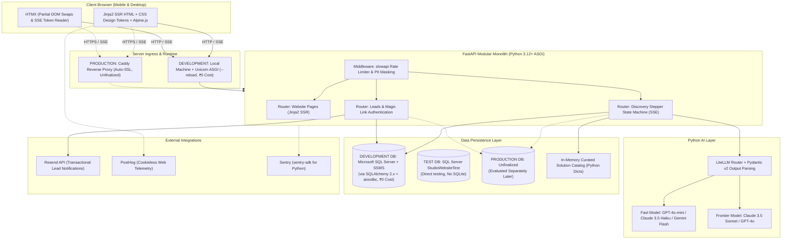

# DECISION EVALUATION & ARCHITECTURAL TRADE-OFF PACKAGE (PYTHON-FIRST)
**Objective Comparative Analysis of Strategic, Technical, AI, and Cost Decisions**

---
Document Owner: Principal Project Architect & Systems Planner  
Status: PROPOSED  
Version: 2.0.0  
Last Updated: 2026-09-07  
Dependencies: [PROJECT_PRINCIPLES.md](file:///d:/Project_website/docs/00-project/PROJECT_PRINCIPLES.md), [TECHNOLOGY_DECISION_FRAMEWORK.md](file:///d:/Project_website/docs/00-project/TECHNOLOGY_DECISION_FRAMEWORK.md), [PROJECT_CONSTRAINTS.md](file:///d:/Project_website/docs/00-project/PROJECT_CONSTRAINTS.md)  
Related Documents: [PYTHON_FIRST_ARCHITECTURE_EVALUATION.md](file:///d:/Project_website/docs/00-project/PYTHON_FIRST_ARCHITECTURE_EVALUATION.md), [MVP_ARCHITECTURE_OPTION.md](file:///d:/Project_website/docs/00-project/MVP_ARCHITECTURE_OPTION.md)  
Decision Status: PROJECT OWNER DECISION REQUIRED FOR ALL SECTIONS  
---

## 1. Executive Summary & Hard Constraint

This document presents an objective, evidence-based evaluation package across business strategy, technical architecture, artificial intelligence systems, infrastructure hosting, security protocols, and operational costs.

### 1.1 The Hard Project Constraint: Python-First
The Project Owner possesses strong practical expertise in the **Python ecosystem** and mandates that the platform be built Python-first so that the entire codebase can be understood, maintained, extended, debugged, and managed independently.

> **"Python-first is a hard project constraint, not merely a technology preference."**

### 1.2 Core Architectural Principles
1. **Maintainability First**: The Project Owner must be able to inspect and modify any part of the codebase without context-switching into a foreign JavaScript build toolchain (`npm`, `webpack`, `vite`, `node_modules`).
2. **Free-First $\rightarrow$ Low-Cost $\rightarrow$ Paid When Justified**: Preference for zero-marginal-cost open-source and verified free tiers for MVP development, avoiding premature SaaS subscription sprawl.
3. **Architecture Simplicity**: Modular monolith baseline; strict avoidance of unnecessary microservices, multi-agent frameworks, and dedicated vector databases until justified by proven operational scale.
4. **Deterministic Predictability**: Deterministic Python code handles state machines, data persistence, and calculations; AI is confined strictly to unstructured extraction, semantic translation, and creative synthesis; humans retain final commercial sign-off.

---

## 2. Business Decisions

The following strategic decisions are reserved exclusively for Project Owner determination.

---

### 2.1 Brand Name & Legal Identity
* **Status**: `PROJECT OWNER DECISION REQUIRED`
* **Context**: The studio requires an official commercial name, brand identity, and web domain. Initial drafts utilized a working parameter `[STUDIO_NAME]` (with codename examples such as "CognitiveForge").
* **Options**:
  - **Option 1**: Retain a parameterized placeholder `[STUDIO_NAME]` across all docs until the Project Owner completes trademark search and domain acquisition.
  - **Option 2**: Project Owner supplies the finalized legal brand name and primary domain immediately.
* **Advantages**: Option 1 prevents project stalling; Option 2 allows domain-specific copywriting, SEO keyword mapping, and branded email setup.
* **Disadvantages**: Option 1 requires search-and-replace upon launch; Option 2 may delay documentation if trademark checks take weeks.
* **Risks**: Selecting an uncleared brand name risks future re-branding costs, trademark infringement disputes, and lost SEO equity.
* **Business Implications**: Dictates brand voice, visual typography, cultural resonance, and domain authority.
* **Recommendation**: **Option 1 (Parameterized Placeholder)** unless the Project Owner already owns and has legally cleared the final brand name.
* **What Information Is Still Needed**: Project Owner confirmation of legal trademark clearance and confirmed web domain.

---

### 2.2 Commercial Pricing Model & Discovery Monetization
* **Status**: `PROJECT OWNER DECISION REQUIRED`
* **Context**: The company is an AI-native technology partner serving Startups, SMEs, and Growing Businesses. We must establish how pre-sales problem discovery and subsequent custom engineering are billed.
* **Options**:
  - **Option 1 (Freemium Diagnostic $\rightarrow$ Paid Problem Discovery Sprint)**: Free online AI discovery producing an Executive Opportunity Map; comprehensive architectural blueprinting and fixed-scope roadmapping sold as a 1-week paid "Discovery Sprint" ($1,500 - $3,500 / ₹1,20,000 - ₹2,50,000), 100% credited toward the build contract if the client signs.
  - **Option 2 (Pure Free Consulting / Sales Overhead)**: All discovery, solution blueprints, and proposals provided free as pre-sales overhead. Build contracts billed as fixed-price milestones or monthly sprint retainers.
  - **Option 3 (Upfront Paywall)**: Access to the interactive AI discovery engine requires upfront payment.
* **Advantages**:
  - Option 1 filters out low-intent inquiries, covers senior architect time, positions the studio as an elite consultancy, and establishes commercial commitment early.
  - Option 2 eliminates friction for prospects; maximizes lead capture volume.
  - Option 3 monetizes immediately from website traffic.
* **Disadvantages**:
  - Option 1 requires sales discipline to close paid sprints.
  - Option 2 burns senior engineering hours on unqualified tire-kickers.
  - Option 3 creates massive top-of-funnel drop-off for an unproven new brand.
* **Risks**: Option 2 threatens studio gross margins; Option 3 will likely result in near-zero inbound adoption.
* **Business Implications**: Directly impacts early-stage studio cash flow, sales cycle duration, and qualified lead-to-close ratios.
* **Recommendation**: **Option 1 (Freemium Diagnostic $\rightarrow$ Paid Discovery Sprint)**.
* **What Information Is Still Needed**: Project Owner approval of the pre-sales monetization strategy and target pricing thresholds for the Indian vs Global market.

---

### 2.3 Launch Geography & Currency Implementation
* **Status**: `PROJECT OWNER DECISION REQUIRED`
* **Context**: The master directive specifies an initial market trajectory of **India $\rightarrow$ Global**.
* **Options**:
  - **Option 1 (Dual-Currency Adaptive Routing)**: Geo-IP detection serves `INR (₹)` via domestic payment rails (UPI/NEFT/Cards via Razorpay with automated GST invoicing) for India, and `USD ($)` via Stripe for international clients.
  - **Option 2 (India-First Domestic Invoicing)**: Launch MVP exclusively in `INR (₹)` with Razorpay; defer foreign currency and Stripe integration to Phase 2.
  - **Option 3 (Global USD Baseline)**: Price everything globally in `USD ($)` via Stripe from Day 1.
* **Advantages**:
  - Option 1 captures domestic Indian SME demand with native tax compliance while accepting international inbound inquiries.
  - Option 2 minimizes initial payment gateway setup complexity.
  - Option 3 standardizes accounting into a single global currency.
* **Disadvantages**:
  - Option 1 requires managing dual merchant accounts and FX conversion policies.
  - Option 2 turns away international clients during initial launch.
  - Option 3 alienates Indian SMEs who require domestic GST input tax credits and UPI payment methods.
* **Risks**: Regulatory non-compliance with Indian GST laws if international payment processors are used for domestic B2B transactions.
* **Business Implications**: Affects legal incorporation structure, bank account requirements, and merchant gateway approvals.
* **Recommendation**: **Option 1 (Dual-Currency Adaptive Routing)** for production, with Option 2 acceptable for closed MVP beta testing.
* **What Information Is Still Needed**: Legal entity registration details (India Private Limited vs US LLC) and merchant gateway account status.

---

### 2.4 SLA Commitments & Response Policies
* **Status**: `PROJECT OWNER DECISION REQUIRED`
* **Context**: Initial discussions proposed a 24-business-hour turnaround for human Principal Architect review of proposal requests generated by the AI discovery engine.
* **Options**:
  - **Option 1 (Internal Operational Target / Non-Binding Policy)**: Publish an estimated turnaround window (*"Typically reviewed by a Principal Architect within 1 business day"*), while treating 24 hours as an internal team KPI.
  - **Option 2 (Binding Commercial SLA Guarantee)**: Legally guarantee a 24-hour response on the website with financial or fee-credit penalties for missed deadlines.
  - **Option 3 (Uncommitted Queue)**: Display generic copy (*"Our team will review your submission and reach out shortly"*).
* **Advantages**:
  - Option 1 signals elite responsiveness and professionalism without legal exposure.
  - Option 2 creates strong competitive differentiation and urgency.
  - Option 3 eliminates operational stress on a small founding team.
* **Disadvantages**:
  - Option 2 exposes the business to liability during inquiry surges or team absences.
  - Option 3 reduces urgency; prospective clients may engage faster-moving competitors.
* **Risks**: Publicly promising an SLA that a small or single-architect founding team cannot consistently fulfill during travel or illness.
* **Business Implications**: Governs team staffing, weekend coverage, and lead triage processes.
* **Recommendation**: **Option 1 (Internal Operational Target / Non-Binding Policy)**.
* **What Information Is Still Needed**: Project Owner confirmation of available daily architect review capacity.

---

### 2.5 Legal & Compliance Commitments
* **Status**: `PROJECT OWNER DECISION REQUIRED`
* **Context**: The platform will process business workflow data, operational bottlenecks, and corporate contact details.
* **Options**:
  - **Option 1 (Compliance-Ready Architecture + Explicit Disclaimers)**: Implement technical data protection controls (PII sanitization, encrypted storage, zero LLM model training on user data), clearly stating on the website: *"Designed to support India DPDP Act 2023 and EU GDPR data protection principles."*
  - **Option 2 (Formal Certified Compliance Claims)**: Publicly market full formal compliance certifications (SOC 2, ISO 27001, GDPR certified) from launch.
* **Advantages**:
  - Option 1 provides accurate, honest enterprise transparency without legal exposure.
  - Option 2 builds maximum immediate enterprise credibility.
* **Disadvantages**: Option 2 requires tens of thousands of dollars in formal third-party audit fees and 6-12 months of audit history that an unlaunched startup cannot possess.
* **Risks**: False advertising or regulatory sanctions for claiming legal certifications before third-party audits are completed.
* **Business Implications**: Directs legal budget allocation and insurance underwriting.
* **Recommendation**: **Option 1 (Compliance-Ready Architecture + Explicit Disclaimers)**.
* **What Information Is Still Needed**: Engagement of legal counsel to draft official Terms of Service and Privacy Policy.

---

## 3. Technical Decisions (Python-First Re-Evaluation)

---

### 3.1 Frontend Architecture (Compatible with Python/FastAPI)
* **Status**: `PROPOSED — DECISION REQUIRED`
* **Requirement**: Ultra-fast public marketing pages (SEO, Core Web Vitals) combined with dynamic, streaming real-time interactions for AI Project Discovery, manageable by a Python-focused owner.
* **Candidates Evaluated**:
  1. **Option B (FastAPI + Jinja2 + HTMX + Alpine.js + CSS Tokens)**: Server-rendered HTML with HTMX partial DOM swaps and native SSE streaming. Alpine.js for local UI toggles. Zero Node.js.
  2. **Option A (FastAPI + Jinja2 + Vanilla JS)**: Pure server templates with manual imperative JavaScript DOM manipulation.
  3. **Option D (FastAPI Backend + React/Vite SPA)**: Headless Python API with a standalone client-rendered React SPA.

| Evaluation Criterion | Candidate 1: Jinja2 + HTMX + Alpine (Rec.) | Candidate 2: Jinja2 + Vanilla JS | Candidate 3: React / Vite SPA |
| :--- | :--- | :--- | :--- |
| **Python Owner Maintainability**| **Exceptional (Zero Node.js)** | High | Low (Dual runtime context switch) |
| **UI / Micro-Interactions** | **High (Declarative Alpine transitions)**| Moderate (Verbose DOM code) | Maximum (Framer Motion ecosystem) |
| **Streaming AI Ergonomics** | **Native (HTMX SSE extension)** | Manual `ReadableStream` | High (`ai/react` or manual SSE) |
| **SEO & First Contentful Paint**| **Maximum (FCP < 0.8s, Pure SSR)** | **Maximum (FCP < 0.8s, Pure SSR)** | Low (SPA hydration delay) |
| **Total Client JS Bundle** | **~28 KB** (HTMX 14KB + Alpine 14KB) | ~5 KB | 180 KB - 450 KB |
| **Node.js / npm Dependency** | **Zero** | **Zero** | High (500+ `node_modules` packages)|
| **Build & Deployment** | **Single Docker Container** | **Single Docker Container** | Dual build pipelines |

* **Recommendation**: **Option B (FastAPI + Jinja2 + HTMX + Alpine.js)**.
* **Reasoning**: Delivers 100% of the required premium dark-mode aesthetic and streaming AI discovery experience while eliminating the entire Node.js/npm toolchain, keeping the codebase unified in Python and standard HTML.

---

### 3.2 Backend & Application Architecture
* **Status**: `PROPOSED — DECISION REQUIRED`
* **Requirement**: Async concurrency for streaming AI responses, strict input validation, database integration, and high maintainability.
* **Candidates Evaluated**:
  1. **FastAPI (ASGI)**: Native async, Pydantic v2 validation, automatic OpenAPI documentation.
  2. **Flask (WSGI)**: Synchronous baseline; clunky async streaming; lacks native Pydantic integration.
  3. **Django**: Monolithic batteries-included; heavy ORM baggage; async is a second-class layer.

| Evaluation Criterion | Candidate 1: FastAPI (Recommended) | Candidate 2: Flask | Candidate 3: Django |
| :--- | :--- | :--- | :--- |
| **Async Streaming Concurrency**| **Native ASGI (Handles 1,000s of streams)**| Poor (Threaded WSGI workers) | Moderate (ASGI layer on sync ORM) |
| **Data Validation** | **Pydantic v2 (Rust-accelerated)** | Manual / Marshmallow extension | Django Forms / Serializers |
| **Automatic Documentation** | **Interactive Swagger (`/docs`)** | Manual extensions | Manual / DRF spectacular |
| **AI Integration Ergonomics** | **Exceptional** | Moderate | Moderate |
| **Deployment Simplicity** | **Single Uvicorn process** | Gunicorn process | Heavy WSGI/ASGI stack |

* **Recommendation**: **FastAPI (Python 3.12+) Modular Monolith**.
* **Reasoning**: Best-in-class async streaming performance, native Pydantic v2 integration, and directly matches the Project Owner's practical experience.

---

### 3.3 Database Engine & Persistence (Development vs. Production)
* **Status**:
  - **Development Database**: `HARD CONSTRAINT (CST-CNF-008) — CONFIRMED BY PROJECT OWNER`
  - **Production Database**: `SEPARATE DECISION — NOT YET FINALIZED`
* **Development Requirement**: Maximum developer familiarity, ₹0 infrastructure cost, high maintainability, and zero unnecessary toolchain friction.
* **Development Stack (Confirmed)**:
  - **Database Engine**: **Microsoft SQL Server (Developer Edition or Express Edition)**
  - **Database GUI**: **SQL Server Management Studio (SSMS)**
  - **Driver & ORM**: SQLAlchemy 2.x (`aioodbc` async engine / `pyodbc` sync engine & Alembic migrations)
  - **Concurrency**: `READ_COMMITTED_SNAPSHOT` (RCSI) enabled for non-blocking MVCC row-versioning
  - **Connection Pooling**: `QueuePool` with `pool_pre_ping=True` for resilient ODBC handle recovery
  - **Testing Strategy**: Dedicated local SQL Server test database (`StudioWebsiteTest`) with transactional rollbacks (**Do NOT use SQLite**)
* **Why Microsoft SQL Server for Development**:
  - The Project Owner possesses established practical expertise with SQL Server and SSMS.
  - Development maintainability and developer familiarity are high priorities.
  - Eliminates the need to configure PostgreSQL or manage SQLite quirks during early development.
  - Zero licensing or hosting cost for development (SQL Server Developer/Express + SSMS).
* **Elimination of Unnecessary Complexity**:
  - **NO PostgreSQL in development** (unnecessary toolchain overhead).
  - **NO SQLite for testing** (avoids dialect divergence bugs).
  - **NO Redis, MongoDB, or Vector Databases in development**.
  - Exactly **ONE primary development database: Microsoft SQL Server**.
* **Production Status & Decoupling**:
  - The development database constraint does NOT lock production.
  - Production database engine (e.g. PostgreSQL vs. Managed Cloud DB) will be evaluated separately later based on enterprise reliability, automated backups, security, performance, scalability, and cost efficiency.

---

### 3.4 Hosting & Server Infrastructure (Development vs. Production)
* **Status**:
  - **Development Server**: `HARD CONSTRAINT (CST-CNF-008) — CONFIRMED BY PROJECT OWNER`
  - **Production Hosting**: `PROPOSED / TO BE VERIFIED (PROVIDER SELECTION OPEN)`
* **Development Server (Confirmed)**:
  - **Runtime**: Local machine running **Uvicorn ASGI Server with hot reload** (`uvicorn app.main:app --reload --host 127.0.0.1 --port 8000`).
  - **Cost**: **₹0 infrastructure / hosting cost**. No cloud servers or paid hosting allowed during initial development.
  - **Velocity**: Instantaneous hot reload upon code changes; zero network latency; direct connection to local SQL Server.
* **Production Hosting Candidates Under Evaluation**:
  1. *Candidate 1*: Low-cost Linux VPS (Hetzner / DigitalOcean at $5–$10/mo) running Docker Compose (FastAPI + Caddy + Production DB).
  2. *Candidate 2*: Managed Container PaaS (Render.com / Railway.app).
  3. *Candidate 3*: Enterprise Cloud (AWS / Azure / GCP).
* **Production Selection Trigger**: Production hosting will be evaluated and decided separately prior to public launch based on regional latency, uptime guarantees, automated SSL, snapshot backups, and cost efficiency.

---

### 3.5 User Authentication & Session Continuity
* **Status**: `PROPOSED — DECISION REQUIRED`
* **Requirement**: Allow users to run the discovery tool friction-free while providing a secure mechanism to resume or claim their proposal later.
* **Candidates Evaluated**:
  1. **Anonymous Session Cookie $\rightarrow$ Magic Link Email Token (via FastAPI + `itsdangerous` / `PyJWT`)**
  2. **External Managed Auth (Clerk / Auth0)**
  3. **Mandatory Password Accounts Upfront**
* **Recommendation**: **Anonymous Session Cookie $\rightarrow$ Magic Link Email Token**.
* **Reasoning**: Implemented natively in Python in <20 lines of code without monthly SaaS auth fees or password security liabilities.

---

## 4. Artificial Intelligence Decisions (Python-First)

---

### 4.1 Python AI/LLM Libraries & Framework Selection
* **Status**: `PROPOSED — DECISION REQUIRED`
* **Requirement**: Orchestrate LLM calls, enforce structured Pydantic outputs, and manage multi-provider failover without framework bloat.
* **Candidates Evaluated**:
  1. **Direct Official SDKs (`openai`, `anthropic`, `google-genai`) or LiteLLM + Pydantic v2**
  2. **PydanticAI**
  3. **LangChain / LlamaIndex / CrewAI**

| Evaluation Criterion | Candidate 1: LiteLLM / Direct SDKs (Rec.) | Candidate 2: PydanticAI | Candidate 3: LangChain / CrewAI |
| :--- | :--- | :--- | :--- |
| **Dependencies & Bloat** | **Minimal (~2 packages)** | Low (~4 packages) | Severe (100+ packages) |
| **API Stability & Debuggability**| **100% clear stack traces** | High | Low (frequent breaking changes) |
| **Streaming Latency** | **< 1.0 second** | < 1.2 seconds | 5 - 20 seconds |
| **Type Safety** | **Native Pydantic v2** | Native Pydantic v2 | LangChain internal schemas |

* **Recommendation**: **Direct Provider SDKs or LiteLLM paired with Pydantic v2**.
* **Reasoning**: LangChain and CrewAI introduce massive architectural bloat, obscure stack traces, and high token overhead. LiteLLM provides a single unified interface across providers with automatic failover in 5 lines of code, while Pydantic v2 handles structured outputs natively.

---

### 4.2 AI Model Routing & Cost Strategy
* **Status**: `PROPOSED — DECISION REQUIRED`
* **Candidates Evaluated**:
  - **Tiered Commercial API Routing (Recommended)**: Small fast model (OpenAI `gpt-4o-mini`, Claude 3.5 `haiku`, or Gemini 1.5 `flash`) for Steps 1–4 ($0.0005/turn) + Frontier model (Claude 3.5 `sonnet` or `gpt-4o`) for final synthesis ($0.015/run). Automatic failover to Gemini 1.5 Flash.
  - **Self-Hosted Open-Weights (Llama 3.3 70B via vLLM on GPU)**: Requires ₹20,000+/mo in fixed GPU rental; economically unviable for MVP volume.
* **Recommendation**: **Tiered Commercial API Routing with Zero Data Retention**.

---

### 4.3 Knowledge Retrieval & Solution Template Search
* **Status**: `PROPOSED — DECISION REQUIRED`
* **Candidates Evaluated**:
  - **Candidate 1: In-Memory Python Dict Catalog (Recommended for MVP)**: 30–50 curated solution templates stored as native Python dictionaries in-repo, matched via tag-based heuristic scoring. Cost: ₹0. Latency: <1ms.
  - **Candidate 2: PostgreSQL `pgvector`**: Embeddings stored and queried inside Postgres. Recommended for Phase 2 when the library exceeds 100 templates.
  - **Candidate 3: Dedicated Vector DB (Pinecone / Qdrant Cloud)**: ₹5,800/mo; unnecessary external SaaS vendor.
* **Recommendation**: **In-Memory Python Catalog for MVP $\rightarrow$ PostgreSQL `pgvector` in Phase 2**.

---

## 5. Security & Privacy Decisions

---

### 5.1 Defense in Depth & Data Safeguards
* **Recommended Controls**:
  1. **Zero-Data-Retention Agreements**: Enforce commercial API terms forbidding vendors from training models on user data.
  2. **Python PII Scrubber Middleware**: Regex and named-entity filters strip personal phone numbers, bank accounts, and credentials before assembling LLM prompts.
  3. **Prompt Injection Isolation**: User inputs are wrapped in structured XML tags (`<user_problem>...</user_problem>`); system instructions forbid instruction override.
  4. **Pydantic Validation Guardrails**: Model responses must parse into Pydantic models; unparseable responses trigger safe fallback messages.
  5. **IP Rate Limiting**: `slowapi` restricts anonymous discovery sessions to 3 per 24 hours per IP address.

---

## 6. Comprehensive Cost Analysis Across Growth Horizons (Python-First)

| Component | MVP Development (Stage 1) | Low-Cost Production Launch (Stage 2) | Growth Stage (~10k Visitors/mo) (Stage 3) |
| :--- | :--- | :--- | :--- |
| **Compute & Server** | **₹0** (Local Uvicorn Server) | **~₹450 to ₹500 / month** ($5-$6 VPS candidate)| ₹900 - ₹1,800 / month ($10-$20 upgraded VPS) |
| **Database** | **₹0** (MS SQL Server Dev/Express + SSMS) | **₹0** (Production DB on same VPS or free tier)| **₹0** (On VPS) or ₹2,100/mo ($25 managed) |
| **AI Inference Tokens** | ₹0 - ₹400 / month (Dev testing) | **~₹800 to ₹2,000 / month** (Pay-as-you-go) | ₹4,000 - ₹12,000 / month (Usage-based) |
| **Authentication** | ₹0 (Native Python tokens) | **₹0** (Zero third-party fees) | ₹0 (Zero third-party fees) |
| **Transactional Email** | ₹0 (Resend Free: 3k/mo) | **₹0** (Within 3k free tier) | ₹1,700 / month ($20 Resend Pro for 50k) |
| **Analytics & Telemetry**| ₹0 (PostHog Free: 1M events/mo) | **₹0** (Within 1M free tier) | ₹0 - ₹2,500 / month (PostHog usage tier) |
| **Error Monitoring** | ₹0 (Sentry Free: 5k errors/mo) | **₹0** (Within 5k free tier) | ₹2,200 / month ($26 Sentry Team tier) |
| **Domain & DNS** | ₹800 - ₹1,200/year (~₹100/mo) | **~₹100 / month** (Domain annual fee) | ~₹100 / month (Domain annual fee) |
| **TOTAL MONTHLY ESTIMATE**| **~₹100 to ₹500 / month** | **~₹1,350 to ₹2,600 / month** | **~₹8,900 to ₹20,300 / month** |
| **EQUIVALENT IN USD** | **~$1 to $6 / month** | **~$16 to $31 / month** | **~$105 to $245 / month** |

*Note: During development, local Uvicorn + Microsoft SQL Server Express/Developer + SSMS incur ₹0 infrastructure cost. For production, hosting FastAPI, Caddy, and the production database inside a containerized VPS keeps fixed infrastructure cost at ~₹500/month flat.*

---

## 7. Proposed Python-First MVP Architecture Blueprint

---

## 8. Summary of Architectural Trade-Offs

| Choice Made in Recommendation | What We Gain | What We Give Up | Justification |
| :--- | :--- | :--- | :--- |
| **Jinja2 + HTMX + Alpine over React SPA** | Zero Node.js, zero npm bloat, 100% Python codebase, instant FCP (<0.8s), native SSE streaming. | Ecosystem of complex React component libraries (Framer Motion). | The Project Owner can maintain and extend the entire application independently. |
| **FastAPI Monolith over Microservices** | Single deployment pipeline, shared Pydantic models, zero network hops, zero CORS issues. | Independent scaling of individual sub-routes. | MVP traffic does not require independent scaling; simplicity is paramount. |
| **MS SQL Server (Dev) + Decoupled Production** | Familiarity with SQL Server/SSMS, ₹0 cost, maintainability, fast local iteration. | Homogeneous dev/prod environment (if prod uses Postgres). | Developer velocity and familiarity are prioritized for development; SQLAlchemy ORM abstraction guarantees portable schema migration to production. |
| **In-Memory Catalog over Dedicated Vector DB** | ₹0 cost, zero latency (<1ms), 100% deterministic matching, zero extra SaaS vendors. | Cosine similarity across millions of unstructured documents. | Studio starts with 30-50 curated templates; a vector DB is premature bloat. |
| **Direct SDKs / LiteLLM over LangChain** | Lightweight (~2MB), clear stack traces, zero breaking API changes, fast sub-second execution. | Complex autonomous agent graph abstractions. | Discovery needs a reliable structured questionnaire, not unpredictable multi-agent loops. |

---

## 9. Summary of Decisions Requiring Project Owner Approval

The following decisions require explicit Project Owner confirmation:

1. **Brand Name**: Confirm parameterized placeholder `[STUDIO_NAME]` or provide official cleared name.
2. **Pricing Model**: Confirm **Freemium Diagnostic $\rightarrow$ Paid Discovery Sprint** vs Pure Free Consulting vs Hard Paywall.
3. **Launch Geography**: Confirm **Dual-Currency (INR ₹ / USD $)** vs India-Only vs USD-Only.
4. **SLA Policy**: Confirm **24-Business-Hour Internal Target (Non-Binding)** vs Formal Guarantee.
5. **Python Technical Baseline**: Confirm **FastAPI + Jinja2/HTMX/Alpine + SQLAlchemy/MS SQL Server (Dev) + SSMS + local Uvicorn (Dev) + LiteLLM**, with production database and hosting decoupled for future evaluation.
6. **MVP Scope**: Confirm the **Must-Have vs Phase 2** boundary detailed in [`MVP_SCOPE_RECOMMENDATION.md`](file:///d:/Project_website/docs/00-project/MVP_SCOPE_RECOMMENDATION.md).
