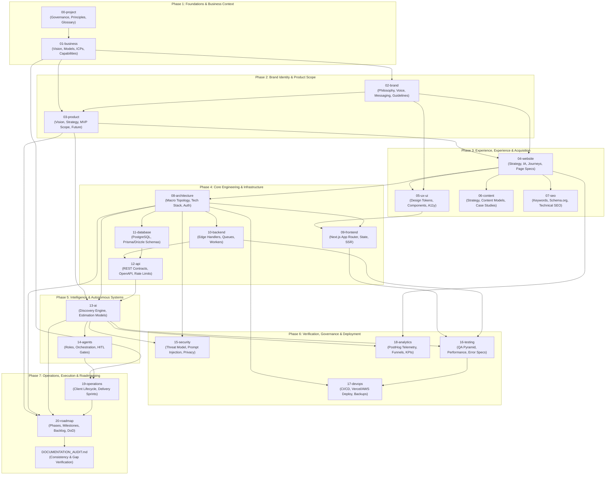

# SYSTEM DEPENDENCY GRAPH & EXECUTION SEQUENCING
**Topological Sort & Dependency Rules for Studio Documentation & Build**

---
Document Owner: Principal Project Architect & Systems Planner  
Status: PROPOSED  
Version: 1.0.0  
Last Updated: 2026-09-07  
Dependencies: [DOCUMENTATION_ARCHITECTURE.md](file:///d:/Project_website/docs/00-project/DOCUMENTATION_ARCHITECTURE.md)  
Related Documents: [DECISION_LOG.md](file:///d:/Project_website/docs/00-project/DECISION_LOG.md), [REQUIREMENTS_REGISTER.md](file:///d:/Project_website/docs/00-project/REQUIREMENTS_REGISTER.md)  
Decision Status: UNDER_REVIEW  
---

## 1. Executive Dependency Thesis

In software engineering and product systems, architectural debt and project failure predominantly stem from **inverted dependencies**—such as writing technical code before determining data schemas, configuring databases before defining user journeys, or drafting marketing copy before locking value propositions.

This system enforces strict **unidirectional dependency ordering**. No document or implementation artifact may be authored if its parent prerequisites contain unvetted assumptions or unresolved decisions.

---

## 2. Global Macro-Phasing Dependency Graph

The entire documentation and construction ecosystem flows across 7 sequentially locked phases:

---

## 3. Micro-Dependency Matrix by Document Domain

### Domain 00: Project Meta-Governance
- **Prerequisites**: Master Prompt Directive.
- **Enables**: All subsequent 20 domains.
- **Rule**: Establishes common vocabulary (`PROJECT_GLOSSARY.md`) and immutable principles (`PROJECT_PRINCIPLES.md`) before any domain-specific strategy is codified.

### Domain 01: Business Strategy
- **Prerequisites**: `00-project/PROJECT_PRINCIPLES.md`.
- **Enables**: Brand, Product, Website, and Operations.
- **Rationale**: You cannot design an effective technical architecture or write compelling copy without understanding who pays, why they pay, what problem is being solved, and how the studio captures value.

### Domain 02: Brand & Narrative
- **Prerequisites**: `01-business/COMPANY_VISION.md`, `VALUE_PROPOSITION.md`, `POSITIONING.md`.
- **Enables**: `03-product/`, `04-website/`, `05-ux-ui/`, `06-content/`.
- **Rationale**: The tone of voice, visual weight, and core promise ("We understand the problem before proposing the solution") dictate how the UI is styled and how the AI interacts with users.

### Domain 03: Product Strategy
- **Prerequisites**: `01-business/SERVICES.md`, `02-brand/BRAND_MESSAGING.md`.
- **Enables**: `04-website/` and `13-ai/AI_DISCOVERY_ENGINE.md`.
- **Rationale**: Differentiates between the minimum viable product (MVP) launch scope and the long-term vision of an autonomous AI-native Technology Studio.

### Domain 04: Website Architecture
- **Prerequisites**: `03-product/MVP_SCOPE.md`, `02-brand/BRAND_GUIDELINES.md`.
- **Enables**: `05-ux-ui/`, `06-content/`, `07-seo/`, and `08-architecture/SYSTEM_ARCHITECTURE.md`.
- **Rationale**: Translates product capabilities into concrete web pages, interactive flows, and conversion funnels.

### Domain 05: UX/UI & Design System
- **Prerequisites**: `04-website/PAGE_SPECIFICATIONS.md`, `02-brand/BRAND_GUIDELINES.md`.
- **Enables**: `09-frontend/FRONTEND_ARCHITECTURE.md`.
- **Rationale**: Engineering cannot implement CSS tokens or React components without a finalized design system and accessibility constraints.

### Domain 06: Content & 07: SEO
- **Prerequisites**: `04-website/INFORMATION_ARCHITECTURE.md`, `01-business/SOLUTIONS.md`.
- **Enables**: Page copy population and organic search indexing strategies.

### Domain 08: Technical Architecture
- **Prerequisites**: `04-website/WEBSITE_ARCHITECTURE.md`, `03-product/MVP_SCOPE.md`.
- **Enables**: `09-frontend/`, `10-backend/`, `11-database/`, `12-api/`, `13-ai/`.
- **Rationale**: Defines overall topology, hosting runtime, security boundaries, and cross-cutting patterns.

### Domain 09 through 12: Core Engineering (Frontend, Backend, Database, API)
- **Prerequisites**: `08-architecture/SYSTEM_ARCHITECTURE.md` and `TECH_STACK.md`.
- **Enables**: `13-ai/`, `15-security/`, `16-testing/`, `17-devops/`.
- **Rationale**: Concrete technical specifications for Next.js 15, PostgreSQL schemas, API contracts, and background job queues.

### Domain 13 & 14: AI Systems & Multi-Agent Architecture
- **Prerequisites**: `03-product/PRODUCT_STRATEGY.md`, `08-architecture/`, `12-api/`.
- **Enables**: `15-security/THREAT_MODEL.md` (prompt injection) and `19-operations/PROPOSAL_WORKFLOW.md`.
- **Rationale**: The signature AI Project Discovery System requires a strict state machine, JSON schema validation, and Human-in-the-Loop approval gates.

### Domain 15 through 18: Security, QA, DevOps & Telemetry
- **Prerequisites**: `08-architecture/` through `14-agents/`.
- **Enables**: Safe, audited, observable deployment pipelines.

### Domain 19 & 20: Operations & Roadmap
- **Prerequisites**: All prior domains (00 through 18).
- **Enables**: Production sprint execution, launch gating, and post-launch maintenance.

---

## 4. Requirement Traceability Vector Scheme

To maintain total coherence from executive strategy to terminal testing, all artifacts follow this traceability path:

$$\text{Business Goal (BR)} \longrightarrow \text{Product Feature (PR)} \longrightarrow \text{User Experience (UX)} \longrightarrow \text{Functional Spec (FR)} \longrightarrow \text{AI/Tech Spec (AI/NFR)} \longrightarrow \text{Test Matrix (QA)}$$

### Traceability Trace Example:
1. **`BR-001`**: Provide frictionless, instant problem diagnostic to qualify B2B prospects.
2. **`PR-001`**: Interactive AI Project Discovery interface capable of dynamic multi-turn dialogue.
3. **`UX-001`**: Conversational stepping interface with inline streaming, zero latency stalls, and visual progress indicators.
4. **`FR-001`**: Server-Sent Events (SSE) endpoint `/api/v1/discovery/chat` streaming tokenized LLM responses with structured state output.
5. **`AI-001`**: Structured JSON schema output containing problem summary, identified risks, and recommended tech pillars.
6. **`SEC-001`**: Real-time prompt injection sanitization on all raw user inputs before feeding LLM context.
7. **`QA-001`**: Playwright end-to-end test completing a 5-step discovery journey with synthetic problem prompt, asserting valid Opportunity Map generation within target response budget (Target hypothesis: < 30 seconds for complete multi-step generation, to be benchmarked).

---

## 5. Topological Execution Sequence for Documentation

To ensure zero missing dependencies or circular logic, documentation creation proceeds in the following topological order:

1. **Batch 1 (Foundations)**: `00-project` (Architecture, Dependency Graph, Decision Log, Overview, Principles, Glossary)
2. **Batch 2 (Business Strategy)**: `01-business` (Company Vision, Business Model, Target Customers, Value Proposition, Positioning, USP, Services, Solutions)
3. **Batch 3 (Brand Identity)**: `02-brand` (Philosophy, Voice, Messaging, Guidelines)
4. **Batch 4 (Product Scope)**: `03-product` (Product Vision, Product Strategy, MVP Scope, Future Scope)
5. **Batch 5 (Website & UX/UI)**: `04-website` & `05-ux-ui` & `06-content` & `07-seo`
6. **Batch 6 (Technical Stack & Architecture)**: `08-architecture` & `09-frontend` & `10-backend` & `11-database` & `12-api`
7. **Batch 7 (AI & Agent Systems)**: `13-ai` & `14-agents`
8. **Batch 8 (Rigor, Security & Reliability)**: `15-security` & `16-testing` & `17-devops` & `18-analytics`
9. **Batch 9 (Operations & Roadmapping)**: `19-operations` & `20-roadmap`
10. **Batch 10 (System Audit)**: `DOCUMENTATION_AUDIT.md`
