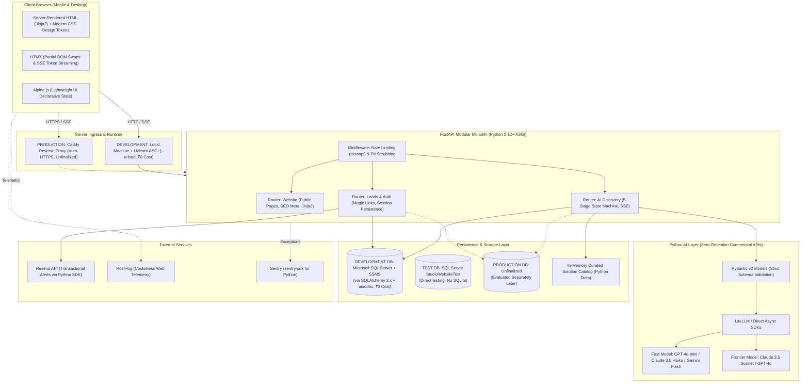

# PROPOSED MVP BASELINE ARCHITECTURE SPECIFICATION (PYTHON-FIRST)
**Technical Component Blueprints, Cost Models, Boundary Contracts, and Replacement Triggers**

---
Document Owner: Principal Project Architect & Systems Planner  
Status: PROPOSED  
Version: 2.1.0  
Last Updated: 2026-09-07  
Dependencies: [PROJECT_PRINCIPLES.md](file:///d:/Project_website/docs/00-project/PROJECT_PRINCIPLES.md), [TECHNOLOGY_DECISION_FRAMEWORK.md](file:///d:/Project_website/docs/00-project/TECHNOLOGY_DECISION_FRAMEWORK.md), [PYTHON_FIRST_ARCHITECTURE_EVALUATION.md](file:///d:/Project_website/docs/00-project/PYTHON_FIRST_ARCHITECTURE_EVALUATION.md)  
Related Documents: [MVP_SCOPE_RECOMMENDATION.md](file:///d:/Project_website/docs/00-project/MVP_SCOPE_RECOMMENDATION.md), [DECISION_EVALUATION.md](file:///d:/Project_website/docs/00-project/DECISION_EVALUATION.md)  
Decision Status: PROPOSED BASELINE — REQUIRES PROJECT OWNER APPROVAL  
---

## 1. Executive Intent & Architecture Status

> [!IMPORTANT]
> **This document is NOT an approved architecture.** It is a proposed baseline architecture reflecting the **Hard Project Constraint: Python-First**, designed so the Project Owner can understand, maintain, debug, and extend 100% of the codebase independently without reliance on complex JavaScript/Node.js build pipelines.

The architecture is structured as a **Python-First Modular Monolith**. It unites server-rendered HTML (Jinja2 + HTMX + Alpine.js), async API routing (FastAPI), type-safe relational persistence (SQLAlchemy 2.x + Alembic), and native Python AI integrations into a single cohesive repository.

### Proposed Architecture Baseline Summary

#### 1. DEVELOPMENT ENVIRONMENT (HARD CONSTRAINT: CST-CNF-008)
* **Core Runtime**: Python 3.12+
* **Backend Framework**: FastAPI (Modular Monolith)
* **Development Server**: Local machine running **Uvicorn with hot reload** (`uvicorn app.main:app --reload --port 8000`)
* **Development Database**: **Microsoft SQL Server** (Developer Edition or Express Edition)
* **Database Management Tool**: **SQL Server Management Studio (SSMS)**
* **ORM & Database Drivers**: SQLAlchemy 2.x (`aioodbc` async engine / `pyodbc` sync engine & Alembic)
* **Database Migrations**: Alembic (`mssql` dialect compatibility)
* **Testing Strategy**: Dedicated local SQL Server test database (`StudioWebsiteTest`) using transactional rollbacks (**Do NOT use SQLite**)
* **Development Infrastructure Cost**: **₹0 (Zero Cost Mandate)**

#### 2. PRODUCTION ENVIRONMENT (DECOUPLED / UNFINALIZED)
* **Production Database Engine**: **Not yet finalized** (evaluated separately later based on enterprise reliability, security, backup/recovery, performance, scalability, and cost efficiency)
* **Production Hosting Provider**: **Not yet finalized** (candidate low-cost Linux VPS or container PaaS to be evaluated separately)
* **Frontend Layer**: Jinja2 Server-Side Templates + HTMX (~14KB) + Alpine.js (~15KB) + Modern CSS Design Tokens
* **AI Orchestration**: Direct provider SDKs (`anthropic`, `openai`, `google-genai`) or LiteLLM + Pydantic v2 structured outputs
* **AI Workflow**: Deterministic 5-stage stepper state machine (no autonomous multi-agent loops)
* **Guiding Principle**: FREE-FIRST $\rightarrow$ LOW-COST $\rightarrow$ PAID WHEN JUSTIFIED



---

## 2. Component-by-Component Architectural Blueprint

---

### Component 1: Frontend Layer
* **Technology**: **Jinja2 Server-Side Templates + HTMX (~14KB) + Alpine.js (~15KB) + Modern CSS Design Tokens**.
* **Why It Exists**: Delivers a high-performance, dark-mode futuristic public website (SEO, Core Web Vitals) and interactive diagnostic user flows without requiring a Node.js runtime or complex frontend bundling.
* **Why This Option**:
  - **Zero Node.js Overhead**: Eliminates `npm`, `package.json`, and broken webpack/vite configurations. All templates are standard HTML with declarative attributes.
  - **Native Streaming via HTMX**: HTMX's native Server-Sent Events extension (`hx-ext="sse"`) connects directly to FastAPI's `StreamingResponse`, streaming AI tokens into the browser in real-time with zero custom JavaScript.
  - **Declarative Micro-Interactions**: Alpine.js handles mobile menus, accordions, and multi-choice pill toggles directly in HTML attributes (`x-data`, `x-show`, `x-transition`).
  - **SEO & Performance Targets**: Pages are pure server-rendered HTML on initial load; target hypothesis: First Contentful Paint (FCP) < 1.2s (to be empirically benchmarked); zero JavaScript hydration lag.
* **What It Costs (Planning Estimate)**:
  - **MVP Development**: **₹0** (Free — bundled inside FastAPI static/template directories).
  - **Production Launch**: **₹0** (Free — runs inside the Python server process).
* **What Its Alternatives Are**:
  - *React / Vite SPA*: High context-switching friction for a Python owner; dual build pipelines; poor out-of-the-box SEO.
  - *Pure Vanilla JS*: Requires verbose, error-prone imperative DOM manipulation for multi-turn discovery steps.
* **What Would Cause Us to Replace It**:
  - If the product evolves into a complex visual canvas tool (e.g. interactive drag-and-drop workflow designer), which would strictly justify an isolated React component island.

---

### Component 2: Backend & Application Core Layer
* **Technology**: **Python 3.12+ with FastAPI and Uvicorn ASGI Server**.
* **Why It Exists**: Serves website routes, handles discovery state progression, validates incoming data, enforces rate limits, scrubs PII, orchestrates LLM calls, and interfaces with the database.
* **Why This Option**:
  - **Project Owner Alignment**: Directly matches the Project Owner's established engineering expertise, maximizing independent maintainability.
  - **Native Async Concurrency**: Essential for non-blocking streaming of LLM tokens via asynchronous generators (`async def`, `StreamingResponse`).
  - **Pydantic v2 Type Safety**: Data parsing is validated automatically with compiled Rust speed.
  - **Single Runtime**: The entire application (HTML serving, API logic, AI orchestration, background tasks) runs in a single Python process.
  - **Automated OpenAPI Specs**: Automatic interactive documentation (`/docs`) makes endpoint testing effortless.
* **Development Server Execution**:
  - Runs locally via `uvicorn app.main:app --reload --host 127.0.0.1 --port 8000`.
  - Hot reload updates code instantly without rebuild pipelines.
* **What It Costs (Planning Estimate)**:
  - **MVP Development**: **₹0** (Free — runs locally via Uvicorn).
  - **Production Launch**: Bundled in containerized Linux environment (~₹450 to ₹900/mo VPS planning estimate; hosting provider unfinalized).
* **What Its Alternatives Are**:
  - *Django*: Excessively heavy; async support is second-class; complex ORM overhead for lightweight AI pipelines.
  - *Flask*: Synchronous WSGI baseline handles concurrent streaming poorly compared to native ASGI.
* **What Would Cause Us to Replace It**:
  - No foreseeable reason to replace FastAPI; it satisfies all technical, async, and maintainability requirements.

---

### Component 3: Database & ORM Layer (Development vs. Production)

#### A. Development Database: Microsoft SQL Server + SSMS (Confirmed Constraint)
* **Technology**: **Microsoft SQL Server (Developer Edition or Express Edition) + SQL Server Management Studio (SSMS) via SQLAlchemy 2.x (`aioodbc` async / `pyodbc` sync) + Alembic Migrations**.
* **Why This Option for Development**:
  - **Project Owner Familiarity**: The Project Owner possesses strong practical experience with SQL Server and SSMS. Utilizing existing expertise maximizes development velocity and system maintainability.
  - **Visual Inspection via SSMS**: Immediate, rich GUI inspection of tables, relationships, indexes, execution plans, and data without third-party web admin tools.
  - **Simplicity Over Novelty**: Eliminates the overhead of configuring PostgreSQL containers or debugging SQLite quirks during early development.
  - **Zero Cost (₹0)**: SQL Server Developer Edition (full enterprise engine licensed free for development) or SQL Server Express Edition paired with SSMS incur ₹0 infrastructure or software licensing costs.
  - **Non-Blocking Concurrency**: Configured with Read Committed Snapshot Isolation (RCSI) (`ALTER DATABASE StudioWebsiteDev SET READ_COMMITTED_SNAPSHOT ON;`), providing MVCC row-versioning where readers never block writers and writers never block readers.
  - **Connection Resilience**: SQLAlchemy `QueuePool` with `pool_pre_ping=True` automatically detects and recovers from dropped ODBC handles.
* **Testing Strategy (No SQLite)**:
  - Automated tests execute against a dedicated local SQL Server test database: `StudioWebsiteTest`.
  - Pytest fixtures wrap each test in an isolated transaction that rolls back on completion.
  - **SQLite is strictly avoided** to eliminate dialect discrepancies (data types, JSON querying, datetime formats, lock semantics).
* **Elimination of Unnecessary Complexity**:
  - **NO PostgreSQL in development** (unnecessary toolchain overhead).
  - **NO SQLite in development or testing** (avoids dialect divergence).
  - **NO Redis** (in-memory token bucket and `BackgroundTasks` suffice for MVP).
  - **NO MongoDB** (relational integrity required).
  - **NO Vector Database** (in-memory Python dict catalog for 30–50 templates).
  - **Exactly ONE primary development database: Microsoft SQL Server**.

#### B. Production Database: Explicitly Decoupled & Unfinalized
* **Status**: **NOT YET FINALIZED / EVALUATED SEPARATELY LATER**.
* **Policy**: The development database constraint does NOT lock the production database engine or cloud hosting provider.
* **Production Evaluation Criteria**: Production architecture will later optimize for:
  1. High availability and enterprise reliability
  2. Data protection, encryption at rest, and zero-trust security
  3. Automated point-in-time backup and disaster recovery
  4. Multi-region query performance and low-latency replication
  5. Scalability under sustained production traffic
  6. Operating cost efficiency within studio revenue
* **What It Costs (Planning Estimate)**:
  - **MVP Development**: **₹0** (Free — Microsoft SQL Server Express / Developer + SSMS locally).
  - **Production Launch**: **₹0** (Free managed tier or bundled DB on VPS) or **~₹1,200 to ₹2,100 / month** ($15 - $25 managed DB).
* **What Would Cause Us to Replace It in Development**:
  - No reason to replace SQL Server in development; it satisfies all developer familiarity and maintainability constraints.

---

### Component 4: Authentication & Session Continuity
* **Technology**: **Anonymous UUID Cookie $\rightarrow$ Magic Link Email Token (via FastAPI + `itsdangerous` / `PyJWT`)**.
* **Why It Exists**: Allows users to interact with the discovery tool instantly without upfront registration, while enabling them to securely resume, edit, or access proposals later via an emailed link.
* **Why This Option**:
  - Zero top-of-funnel friction; visitors complete the diagnostic immediately.
  - Native Python cryptographic libraries (`itsdangerous`, `PyJWT`) generate secure, time-limited magic link tokens in <20 lines of code with zero external auth vendors.
  - Eliminates the security liability of storing and hashing user passwords.
* **What It Costs (Planning Estimate)**: **₹0** (Free — native Python implementation; zero third-party auth fees).
* **What Its Alternatives Are**:
  - *Clerk / Auth0*: Paid third-party SaaS ($25+/mo) introducing unnecessary external dependencies.
  - *Mandatory Password Accounts*: Severe conversion drop on top-of-funnel discovery.
* **What Would Cause Us to Replace It**:
  - Enterprise requirements for SAML / Single Sign-On (SSO) with Okta or Azure AD in Phase 3/4.

---

### Component 5: AI Layer & Model Routing
* **Technology**: **Direct Provider SDKs (`openai`, `anthropic`, `google-genai`) and/or LiteLLM + Pydantic v2 Structured Outputs**.
* **Why It Exists**: Translates unstructured business problems into structured parameters, identifies operational bottlenecks, and generates custom Solution Blueprints.
* **Why This Option**:
  - **Tiered Cost Optimization**:
    - Steps 1–4 (Parameter Extraction): Processed by low-cost small models (OpenAI `gpt-4o-mini`, Claude 3.5 `haiku`, or Gemini 1.5 `flash` via free tier) for ~$0.0005 per turn (~₹0.04).
    - Step 5 (Blueprint Synthesis): Processed by frontier models (Claude 3.5 `sonnet` or `gpt-4o`) for ~$0.015 (~₹1.25).
  - **Pydantic v2 Type Enforcement**: Models output strict JSON validated directly against Pydantic classes; malformed responses are caught and handled before rendering.
  - **Automatic Failover**: If the primary API times out or throws a 5xx error, LiteLLM or an async Python fallback router switches to Google Gemini 1.5 Flash instantly.
* **What It Costs (Planning Estimate — Usage-Based)**:
  - **MVP Development**: **₹0 – ₹400 / month** (Usage-based — developer testing).
  - **Production Launch**: **~₹800 – ₹2,000 / month** (Usage-based — dependent entirely on user discovery volume).
* **What Its Alternatives Are**:
  - *LangChain / CrewAI*: Bloated, fragile abstractions (100+ dependencies) that cause debugging nightmares and token latency stalls.
  - *Self-Hosted Llama 3.3 70B*: Requires ₹20,000+/mo in dedicated cloud GPU rentals before scale is achieved.
* **What Would Cause Us to Replace It**:
  - If commercial API pricing increases significantly or strict enterprise privacy mandates forbid cloud APIs (triggering a transition to self-hosted vLLM on a dedicated GPU).

---

### Component 6: Signature AI Project Discovery Engine
* **Architectural Boundaries (Strict Functional Partitioning)**:

```
┌─────────────────────────────────────────────────────────────────────────┐
│              DETERMINISTIC SOFTWARE (FASTAPI + PYTHON 3.12)             │
│  - 5-stage linear progress stepper state machine.                       │
│  - HTMX partial swaps: Replaces only the active step container.         │
│  - Session token creation and cookie persistence.                       │
│  - PII masking via Python regex/scrubbers before model submission.       │
│  - IP rate limiting via slowapi (in-memory token bucket).               │
│  - Pydantic schema validation: Rejects any malformed JSON before UI     │
│    rendering.                                                           │
│  - Complexity-weighted mathematical scoring formula for indicative     │
│    estimation ranges (not freeform LLM guesses).                        │
│  - Matching problem tags to curated Python architecture templates.      │
│  - Data persistence via SQLAlchemy 2.x models (MS SQL Server for dev).  │
└─────────────────────────────────────────────────────────────────────────┘
                                   │
                                   ▼
┌─────────────────────────────────────────────────────────────────────────┐
│                         ARTIFICIAL INTELLIGENCE (LLM)                   │
│  - Semantic interpretation of unstructured user business problems.      │
│  - Generating dynamic, contextual clarifying follow-up questions.       │
│  - Extracting pain points, constraints, and integration targets.         │
│  - Synthesizing qualitative operational bottleneck narratives.          │
│  - Generating the preliminary Solution Blueprint narrative.             │
└─────────────────────────────────────────────────────────────────────────┘
                                   │
                                   ▼
┌─────────────────────────────────────────────────────────────────────────┐
│                       HUMAN REVIEW (PRINCIPAL ARCHITECT)                │
│  - Inspecting inbound discovery briefs in admin queue.                  │
│  - Validating real-world technical and delivery feasibility.            │
│  - Adjusting indicative estimates into binding commercial SOW proposals.│
│  - Signing off on formal client commitments and contracts.              │
│  - Client consultation calls and high-stakes relationship management.   │
└─────────────────────────────────────────────────────────────────────────┘
```

---

### Component 7: Estimation Engine
* **Technology**: **Deterministic Python Mathematical Complexity Model** (Module: `app.discovery.estimator`).
* **Why It Exists**: Generates indicative timeline ranges (in weeks) and budgetary bands to qualify client expectations without legal or delivery liability.
* **Why This Option**:
  - An LLM must **never** be permitted to guess pricing numbers freely; it hallucinates inconsistent quotes for identical requirements.
  - The Python formula assigns calibrated numerical weights based on extracted tags:
    ```python
    complexity_score = (
        sum(pillar_weights[p] for p in selected_pillars)
        + integration_complexity[integration_count]
        + scale_multiplier[user_scale]
        + compliance_risk_factor[risk_level]
    )
    ```
  - The score maps deterministically to calibrated historical delivery bands (e.g., *Low: 4–6 weeks | Medium: 7–10 weeks | High: 11–16 weeks*).
  - Explicit legal disclaimer: *"Indicative estimate generated algorithmically for planning purposes. Final fixed-price contracts require Principal Architect review."*
* **What It Costs (Planning Estimate)**: **₹0** (Free — pure Python function).
* **What Its Alternatives Are**: Freeform LLM generation (rejected due to severe commercial liability).

---

### Component 8: Storage Layer
* **Technology**: **In-Repository Static Files (MVP) $\rightarrow$ Cloudflare R2 (Phase 2)**.
* **Why It Exists**: Serves website visual assets, brand icons, and downloadable PDF reports.
* **Why This Option**:
  - In MVP, all brand graphics and case study images live inside FastAPI's `/static` directory, cached by Caddy and Cloudflare's CDN.
  - Cloudflare R2 provides S3-compatible storage with **zero egress bandwidth fees** and 10GB free storage for Phase 2 downloadable assets.
* **What It Costs (Planning Estimate)**:
  - **MVP**: **₹0** (Free — bundled in Git repo and CDN).
  - **Phase 2**: **₹0** (Free Tier — within Cloudflare R2 10GB free tier).

---

### Component 9: Transactional Email & Lead Notification
* **Technology**: **Resend API (via official `resend` Python SDK) or Postmark**.
* **Why It Exists**: Sends passwordless magic links to users, delivers their Opportunity Map summary, and instantly notifies the studio Principal Architect when a new lead requests a proposal.
* **Why This Option**:
  - Python integration takes 5 lines of code via `resend.Emails.send(...)`.
  - Free tier includes **3,000 emails/month** (100 emails/day), more than sufficient for MVP launch.
* **What It Costs (Planning Estimate)**:
  - **MVP Development**: **₹0** (Free Tier — Resend free tier).
  - **Production Launch**: **₹0** (Free Tier — within 3,000 emails/mo).
  - **Growth Stage**: **~₹1,700 / month** (Paid — $20/mo for 50,000 emails/mo).

---

### Component 10: Analytics & Product Telemetry
* **Technology**: **PostHog (Cloud Free Tier or Cookieless Telemetry)**.
* **Why It Exists**: Measures discovery completion rates, identifies funnel drop-off stages, and tracks marketing page engagement without violating privacy.
* **Why This Option**:
  - Free tier includes **1,000,000 events/month** and 5,000 session replays at ₹0 cost.
  - Lightweight cookieless client-side JavaScript snippet + optional server-side event tracking via the official `posthog-python` SDK.
* **What It Costs (Planning Estimate)**: **₹0** (Free Tier — within 1M events free tier).

---

### Component 11: Error Monitoring & Observability
* **Technology**: **Sentry (via official `sentry-sdk` for Python)**.
* **Why It Exists**: Captures unhandled exceptions, database query errors, and LLM API timeouts in real-time with full stack traces.
* **Why This Option**:
  - Free tier provides **5,000 error events/month** at ₹0 cost.
  - Native FastAPI integration: `sentry_sdk.init(..., integrations=[FastApiIntegration()])`.
* **What It Costs (Planning Estimate)**: **₹0** (Free Tier — within 5,000 errors limit).

---

### Component 12: Deployment & Server Infrastructure (Development vs. Production)

#### A. Development Server Environment (Confirmed Constraint)
* **Technology**: **Local Machine running Uvicorn ASGI Server with Hot Reload (`uvicorn app.main:app --reload --port 8000`)**.
* **Why This Option for Development**:
  - Instantaneous feedback cycle on code changes with hot reload.
  - Zero deployment pipeline lag; zero remote network latency.
  - Connects directly to local Microsoft SQL Server instance.
  - **Infrastructure Cost: ₹0**. No cloud hosting or paid server required for development.

#### B. Production Hosting Infrastructure (Decoupled / Unfinalized)
* **Status**: **NOT YET FINALIZED / TO BE EVALUATED SEPARATELY**.
* **Architecture Candidate**: Containerized Linux Environment (Docker Compose: FastAPI + Caddy Reverse Proxy + Production DB).
* **Evaluation Criteria**: Production hosting will be decided later based on high availability, automated SSL, isolated VPC networking, snapshot backups, and cost efficiency.
* **What It Costs (Planning Estimate)**:
  - **MVP Development**: **₹0** (Free — local Uvicorn server).
  - **Production Launch**: **~₹450 to ₹900 / month ($5 - $10/mo)** (Low Cost — flat-rate VPS candidate).

---

### Component 13: Security Boundaries & Firewalls
* **Technology**: **Cloudflare DNS (Free) + Caddy HTTPS + slowapi Rate Limiting + Pydantic Schema Validation**.
* **Why It Exists**: Shields the platform from DDoS attacks, malicious scrapers, prompt injection, and unauthorized API abuse.
* **Why This Option**:
  - **Cloudflare Free Tier**: Unmetered DDoS mitigation, edge caching, and DNS management.
  - **slowapi**: In-memory Python rate limiting restricts anonymous discovery sessions to 3 per 24 hours per IP address.
  - **Prompt Injection Defense**: Untrusted user text is isolated in encapsulated XML tags (`<user_problem>...</user_problem>`); system instructions forbid instruction override; Pydantic strictly validates all JSON outputs before rendering.
* **What It Costs (Planning Estimate)**: **₹0** (Free Tier — Cloudflare Free Tier + native Python middleware).

---

## 3. Total Cost of Ownership (TCO) Summary Table (Planning Estimates)

> [!NOTE]
> All figures below are **Planning Estimates**, not guaranteed costs. AI API token expenditures vary directly with user discovery volume.

| Component | Cost Classification | Planning Estimate: MVP Development | Planning Estimate: Low-Cost Production | Planning Estimate: Growth (~10k visits/mo) |
| :--- | :--- | :--- | :--- | :--- |
| **Compute & Server** | Free Local / Low Cost VPS | **₹0** (Local Uvicorn Server) | **~₹450 to ₹900 / month** ($5-$10 VPS candidate) | **~₹900 to ₹1,800 / month** ($10-$20 upgraded VPS) |
| **Database** | Free Local / Low Cost DB | **₹0** (MS SQL Server Dev/Express + SSMS) | **₹0** (Production DB on same VPS or free tier)| **₹0** (On VPS) or ₹2,100/mo ($25 managed) |
| **AI Inference Tokens** | Usage-Based (Variable)| **₹0 to ₹400 / month** (Dev testing) | **~₹800 to ₹2,000 / month** (Usage-dependent) | **~₹4,000 to ₹12,000 / month** (Usage-dependent) |
| **Authentication** | Free (Native Code) | **₹0** (Native Python tokens) | **₹0** (Zero third-party fees) | **₹0** (Zero third-party fees) |
| **Transactional Email** | Free Tier $\rightarrow$ Paid | **₹0** (Resend Free: 3,000/mo) | **₹0** (Within 3,000 free tier) | **~₹1,700 / month** ($20 Resend Pro for 50k) |
| **Analytics & Telemetry**| Free Tier $\rightarrow$ Usage | **₹0** (PostHog Free: 1M events/mo) | **₹0** (Within 1M free tier) | **₹0 to ₹2,500 / month** (Usage-based) |
| **Error Monitoring** | Free Tier $\rightarrow$ Paid | **₹0** (Sentry Free: 5,000 errors/mo)| **₹0** (Within 5,000 free tier) | **~₹2,200 / month** ($26 Sentry Team tier) |
| **Domain & DNS** | Paid (Fixed Annual) | **~₹100 / month** (₹800-₹1,200/yr) | **~₹100 / month** (Domain fee amortized) | **~₹100 / month** (Domain fee amortized) |
| **TOTAL PLANNING ESTIMATE**| | **~₹100 to ₹500 / month** | **~₹1,350 to ₹3,000 / month** | **~₹8,900 to ₹20,300 / month** |
| **EQUIVALENT IN USD** | | **~$1 to $6 / month** | **~$16 to $36 / month** | **~$105 to $245 / month** |

---

## 4. Replacement Triggers Summary Table

| Component | Proposed Baseline | What Triggers Replacement? | Migration Path |
| :--- | :--- | :--- | :--- |
| **Frontend** | Jinja2 + HTMX + Alpine | Product pivots into complex visual canvas/Figma-like tool | Layer a React/Vite SPA on isolated sub-routes (`/app/*`) |
| **Backend** | FastAPI Modular Monolith | Unlikely to replace; satisfies async, validation, and maintainability requirements | N/A |
| **Development Server** | Local Uvicorn with `--reload` | Transitioning from local development to production staging | Deploy production container topology to verified hosting provider |
| **Development Database**| Microsoft SQL Server + SSMS | Development phase complete; preparing for production deployment | Evaluate production database engines (PostgreSQL / Managed Cloud DB) independently |
| **AI Layer** | Commercial APIs (Claude/GPT) | API costs exceed $500/mo or strict on-premise mandate | Deploy vLLM with Llama 3.3 on rented GPU instance |
| **Knowledge Base** | In-Memory Python Dict Catalog | Solution templates exceed 100 entries | Evaluate vector search (e.g. relational vector extensions) in Phase 2 |
| **Discovery SM** | Typed State Machine (Python) | Complex multi-agent autonomous negotiation needed | Evaluate `PydanticAI` for Phase 3/4 agent workflows |
