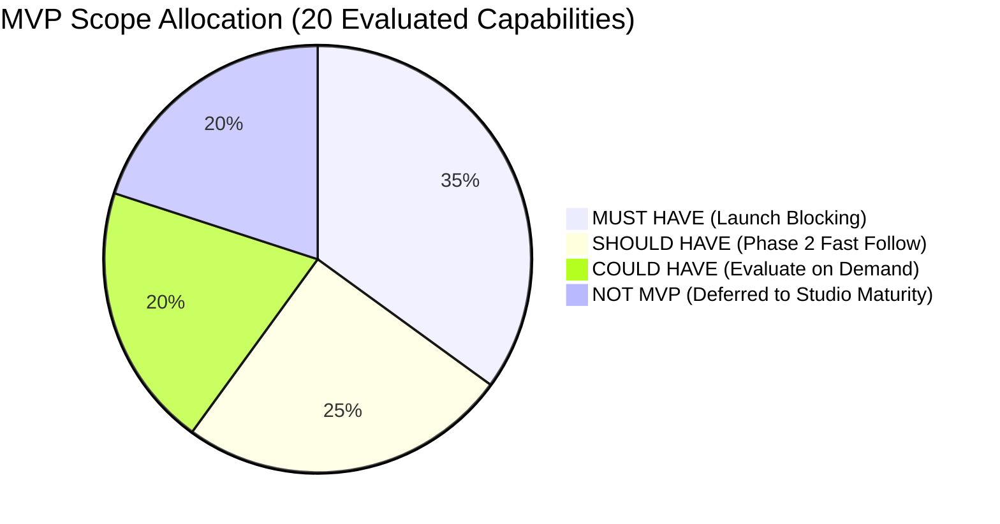

# MVP SCOPE RECOMMENDATION & FEATURE PHASING SPECIFICATION
**MoSCoW Prioritization Matrix, Value Scoring, Complexity Assessment, and Delivery Boundaries**

---
Document Owner: Principal Project Architect & Systems Planner  
Status: PROPOSED  
Version: 1.0.0  
Last Updated: 2026-09-07  
Dependencies: [PROJECT_OVERVIEW.md](file:///d:/Project_website/docs/00-project/PROJECT_OVERVIEW.md), [PROJECT_PRINCIPLES.md](file:///d:/Project_website/docs/00-project/PROJECT_PRINCIPLES.md), [DECISION_EVALUATION.md](file:///d:/Project_website/docs/00-project/DECISION_EVALUATION.md)  
Related Documents: [MVP_ARCHITECTURE_OPTION.md](file:///d:/Project_website/docs/00-project/MVP_ARCHITECTURE_OPTION.md), [REQUIREMENTS_REGISTER.md](file:///d:/Project_website/docs/00-project/REQUIREMENTS_REGISTER.md)  
Decision Status: PROPOSED BASELINE — REQUIRES PROJECT OWNER APPROVAL  
---

## 1. Executive Purpose & Scoping Philosophy

A common failure mode in software studios is attempting to launch with every feature envisioned in the 5-year roadmap. Building client portals, multi-agent frameworks, automated billing, and CRM synchronizers before validating market demand delays launch by months and squanders founding capital.

This document establishes an objective **MoSCoW (Must Have, Should Have, Could Have, Won't Have / Not MVP)** scoping framework.

### Guiding Principles Applied
1. **Launchable, Premium, Fast**: The MVP must feel like an elite, futuristic product on Day 1, not an unfinished toy.
2. **De-Risk Core Innovation**: The signature feature—the **AI Project Discovery Engine**—must work flawlessly, while secondary operational workflows rely on human agility.
3. **Zero Waste**: No code is written for back-office automation until inbound transaction volume creates a demonstrable human bottleneck.

---

## 2. MoSCoW Feature Phasing Summary

| Category | Feature Name | Target Phase | Release Gate |
| :--- | :--- | :--- | :--- |
| **MUST HAVE** | 1. Premium Public Website (Home, Services, Solutions, About, Contact) | MVP | Launch Blocking |
| **MUST HAVE** | 2. Guided 5-Stage AI Project Discovery Stepper | MVP | Launch Blocking |
| **MUST HAVE** | 3. Real-Time Opportunity Map Generation | MVP | Launch Blocking |
| **MUST HAVE** | 4. Progressive Lead Capture Gate (Corporate Email) | MVP | Launch Blocking |
| **MUST HAVE** | 5. Preliminary Solution Blueprint Display | MVP | Launch Blocking |
| **MUST HAVE** | 6. Indicative Estimation Engine (Banded Ranges + Disclaimers)| MVP | Launch Blocking |
| **MUST HAVE** | 7. Architect Lead Notification (Email/Slack Webhook) | MVP | Launch Blocking |
| **SHOULD HAVE**| 8. Automated PDF Summary Download | Phase 2 | Post-Launch Sprint 1 |
| **SHOULD HAVE**| 9. PostgreSQL `pgvector` Semantic Similarity Search | Phase 2 | Post-Launch Sprint 2 |
| **SHOULD HAVE**| 10. Standalone Budget Estimator Calculator | Phase 2 | Post-Launch Sprint 3 |
| **SHOULD HAVE**| 11. Transactional Payment Gateway (Razorpay/Stripe) | Phase 2 | Post-Launch Sprint 4 |
| **SHOULD HAVE**| 12. Automated Case Study CMS & Publishing Engine | Phase 2 | Post-Launch Sprint 5 |
| **COULD HAVE** | 13. Voice AI Speech-to-Text Input for Discovery | Phase 3 | User Testing Demand |
| **COULD HAVE** | 14. WhatsApp Business Inbound Alerts | Phase 3 | Lead Volume Demand |
| **COULD HAVE** | 15. Light/Dark Mode Visual Theme Toggle | Phase 3 | Low Priority Polish |
| **COULD HAVE** | 16. Programmatic SEO Industry Pages | Phase 3 | Organic Traffic Phase |
| **NOT MVP**    | 17. Authenticated Client Portal & Sprint Dashboard | Future (H3) | Client Base Scaling |
| **NOT MVP**    | 18. Full Internal Admin Operations Dashboard | Future (H3) | Team Scaling |
| **NOT MVP**    | 19. Autonomous Multi-Agent Collaboration Engine | Future (H4) | R&D Research |
| **NOT MVP**    | 20. Automated Codebase Scaffolding Generator | Future (H4) | Studio IP Maturity |

---

## 3. Deep-Dive Feature Evaluations

---

### Category A: MUST HAVE (Launch-Blocking Baseline)

---

#### 1. Premium Public Marketing Website
* **Description**: High-speed, responsive public web presence showcasing the company's positioning ("We turn business problems into technology"), 5 capability pillars (BUILD, AI, AUTOMATE, INTEGRATE, SCALE), philosophy, and contact mechanisms.
* **Business Value**: **Critical**. Establishes market credibility, brand authority, and provides the foundation for organic search and referral traffic.
* **User Value**: **High**. Educates prospective clients on what the studio builds and how problem-first technology partnerships work.
* **Complexity**: **Medium**. Requires polished design system tokens, typography scales, and responsive layouts.
* **Dependencies**: `02-brand/BRAND_GUIDELINES.md`, `05-ux-ui/DESIGN_SYSTEM.md`.
* **Risk**: If design looks generic or like an off-the-shelf template, premium positioning collapses.
* **Recommendation**: **MUST HAVE for MVP**. Focus on uncompromising typography, sleek dark mode aesthetics, and micro-animations.

---

#### 2. Guided 5-Stage AI Project Discovery Stepper
* **Description**: Interactive diagnostic tool guiding users through: Context $\rightarrow$ Problem $\rightarrow$ Constraints $\rightarrow$ Goals $\rightarrow$ Synthesis. Uses interactive multi-choice pills + optional text input.
* **Business Value**: **Critical**. The signature differentiator; converts cold traffic into engaged prospects and automates initial discovery qualification.
* **User Value**: **Maximum**. Translates unstructured business pain points into technology categories without requiring technical jargon.
* **Complexity**: **Medium-High**. Requires a deterministic state machine, typed Zod schema parsing, and low-latency LLM API integration.
* **Dependencies**: `MVP_ARCHITECTURE_OPTION.md` Component 6, `13-ai/AI_DISCOVERY_ENGINE.md`.
* **Risk**: High latency or parsing crashes could cause visitors to bounce mid-session.
* **Recommendation**: **MUST HAVE for MVP**. Keep state progression strictly linear and deterministic.

---

#### 3. Real-Time Opportunity Map Generation
* **Description**: Dynamic on-screen diagnostic summary visualizing identified operational bottlenecks, automation opportunities, and high-ROI technology leverage points.
* **Business Value**: **High**. Demonstrates immediate intellectual horsepower and consultative value before asking for money.
* **User Value**: **High**. Gives founders and executives an executive diagnostic of their operational bottlenecks in seconds.
* **Complexity**: **Medium**. Structured JSON output from LLM rendered into polished UI badge components.
* **Dependencies**: Feature 2 (Discovery Stepper).
* **Risk**: Generic or superficial outputs; mitigated by prompt engineering that enforces specific domain constraints.
* **Recommendation**: **MUST HAVE for MVP**. Display on-screen completely ungated.

---

#### 4. Progressive Lead Capture Gate
* **Description**: Email verification gate placed between the high-level Opportunity Map and the detailed Technical Solution Blueprint.
* **Business Value**: **Critical**. The primary conversion hook that captures qualified prospective client leads into the studio sales pipeline.
* **User Value**: **Medium**. User exchanges corporate email for detailed architectural specifications and indicative budget breakdowns.
* **Complexity**: **Low**. Input field with corporate domain validation (regex + MX check) and session association.
* **Dependencies**: Database leads table, Feature 3.
* **Risk**: Abandonment at the gate; mitigated by showing the qualitative Opportunity Map for free first.
* **Recommendation**: **MUST HAVE for MVP**.

---

#### 5. Preliminary Solution Blueprint Display
* **Description**: Tailored technical blueprint recommending specific software architectures, capability pillars, integration points, and risk mitigations matched to the client's problem.
* **Business Value**: **High**. Proves technical competence and de-risks the sales conversation before a call occurs.
* **User Value**: **Maximum**. Gives the client an architectural roadmap of what to build.
* **Complexity**: **Medium**. In-memory pattern matching combined with LLM synthesis.
* **Dependencies**: Feature 4 (Lead Capture Gate).
* **Risk**: Promising unbuildable architectures; bounded by strictly curated template prompts.
* **Recommendation**: **MUST HAVE for MVP**.

---

#### 6. Indicative Estimation Engine
* **Description**: Algorithmically generated delivery timeline (weeks) and budgetary bands based on complexity scoring, accompanied by prominent legal disclaimers.
* **Business Value**: **High**. Pre-qualifies client budget alignment, eliminating time wasted on prospects who cannot afford custom software.
* **User Value**: **High**. Provides budget transparency that traditional agencies conceal.
* **Complexity**: **Low-Medium**. Deterministic formula calculating scores from extracted tags.
* **Dependencies**: Feature 5.
* **Risk**: Client anchors to minimum band; mitigated by bold disclaimers stating binding quotes require architect review.
* **Recommendation**: **MUST HAVE for MVP**.

---

#### 7. Architect Lead Notification & Queue
* **Description**: Instant notification (email via Resend and/or Slack webhook) alerting the Principal Architect when a lead completes discovery and requests a formal proposal.
* **Business Value**: **Critical**. Enables fast response times (targeting <24 business hours) to close high-intent leads while they are warm.
* **User Value**: **High**. Initiates the human-in-the-loop review workflow.
* **Complexity**: **Low**. Webhook / email dispatch on database insert.
* **Dependencies**: `MVP_ARCHITECTURE_OPTION.md` Component 9.
* **Risk**: Email delivery failure; mitigated by logging leads in the primary database (Microsoft SQL Server in development) simultaneously.
* **Recommendation**: **MUST HAVE for MVP**.

---

### Category B: SHOULD HAVE (Phase 2 Fast Follow)

---

#### 8. Automated PDF Proposal Summary Download
* **Description**: Serverless generation of a branded, executive-ready PDF report containing the Opportunity Map, Solution Blueprint, and Indicative Ranges.
* **Business Value**: **Medium-High**. Enables prospects to circulate the proposal internally to co-founders and board members.
* **User Value**: **High**. Tangible takeaway artifact.
* **Complexity**: **Medium**. Headless Chromium PDF rendering (`puppeteer` or `@react-pdf/renderer`) can add cold-start overhead.
* **Dependencies**: Features 3, 5, 6.
* **Risk**: Serverless timeout during PDF compilation on low-memory edge runtimes.
* **Recommendation**: **SHOULD HAVE for Phase 2**. For MVP, users can view on web or print-to-PDF; architects can manually attach a formal PDF during email follow-up.

---

#### 9. PostgreSQL `pgvector` Semantic Similarity Search
* **Description**: High-dimensional vector search matching user problem descriptions to past case studies and architecture repositories.
* **Business Value**: **Medium**. Increases blueprint precision as the studio library grows past 100+ patterns.
* **User Value**: **Medium**. Surfaced case studies are more nuanced.
* **Complexity**: **Medium**. Requires embedding generation (`text-embedding-3-small`) and vector indexing in Postgres.
* **Dependencies**: Feature 5, PostgreSQL database.
* **Risk**: Overkill for MVP when the initial library only contains 30–50 templates.
* **Recommendation**: **SHOULD HAVE for Phase 2**. In-memory heuristic matching is faster, cheaper, and 100% sufficient for MVP.

---

#### 10. Standalone Budget Estimator Calculator
* **Description**: A public interactive slider calculator allowing users to estimate software build costs by toggling platforms, integrations, and user scale.
* **Business Value**: **Medium**. Second top-of-funnel lead magnet for SEO keywords ("software cost calculator").
* **User Value**: **Medium**. Rapid, low-cognition budget ballpark.
* **Complexity**: **Low**. Frontend state calculation with lead capture modal.
* **Dependencies**: Marketing website.
* **Risk**: Cannibalizes the superior AI Project Discovery tool if users bypass discovery in favor of a shallow calculator.
* **Recommendation**: **SHOULD HAVE for Phase 2**. Focus all MVP traffic on the signature AI Discovery engine.

---

#### 11. Transactional Payment Gateway Integration (Razorpay / Stripe)
* **Description**: Self-service online checkout for purchasing paid 1-week Discovery Sprints ($1,500–$3,500 / ₹1,20,000–₹2,50,000) directly from the website.
* **Business Value**: **Medium-High**. Automates pre-sales cash collection.
* **User Value**: **Medium**. Instant checkout via UPI or corporate credit card.
* **Complexity**: **Medium**. Webhook listeners, payment status state machines, automated GST invoicing.
* **Dependencies**: Legal entity and active merchant accounts.
* **Risk**: Most B2B clients prefer receiving a formal SOW and paying via wire transfer/NEFT rather than entering credit cards on a website.
* **Recommendation**: **SHOULD HAVE for Phase 2**. In MVP, clients receive proposals and pay via manual invoicing.

---

#### 12. Automated Case Study CMS & Publishing Engine
* **Description**: Dynamic CMS managing case study publishing with problem-first narrative templates (*Problem $\rightarrow$ Translation $\rightarrow$ Architecture $\rightarrow$ Leverage $\rightarrow$ Business Impact*).
* **Business Value**: **Medium-High**. Vital for long-term SEO and proof of capability.
* **User Value**: **High**. Validates real-world studio execution track record.
* **Complexity**: **Low-Medium**. MDX-based file system or Headless CMS.
* **Dependencies**: Marketing website.
* **Risk**: Building a complex CMS before having 5+ completed client case studies to publish.
* **Recommendation**: **SHOULD HAVE for Phase 2**. For MVP launch, 2–3 flagship anchor case studies hardcoded via MDX suffice.

---

### Category C: COULD HAVE (Evaluate Based on Demand)

---

#### 13. Voice AI Speech-to-Text Input for Discovery
* **Description**: Allows users to speak their business problem into their mobile microphone, transcribing speech into text via Whisper API.
* **Business Value**: **Medium**. Strong "wow" factor reinforcing AI-native positioning.
* **User Value**: **Medium**. Reduces mobile typing friction for verbose founders.
* **Complexity**: **Medium**. Web Audio API recording + OpenAI Whisper API streaming.
* **Dependencies**: Feature 2 (Discovery Stepper).
* **Risk**: Browser microphone permission friction; poor audio quality in noisy environments leading to transcription errors.
* **Recommendation**: **COULD HAVE for Phase 3**. Text and multi-choice pills are more reliable for initial launch.

---

#### 14. WhatsApp Business Inbound Alerts
* **Description**: Automated WhatsApp notification sent to client upon lead submission, plus two-way interactive messaging.
* **Business Value**: **Medium**. Highly relevant for Indian SME market.
* **User Value**: **Medium**. Preferred communication channel for domestic business owners.
* **Complexity**: **Medium-High**. Meta Business Verification, template pre-approval, webhook listeners.
* **Dependencies**: Meta Business Manager account approval.
* **Risk**: High administrative overhead with Meta verification delays.
* **Recommendation**: **COULD HAVE for Phase 3**. Email suffices for MVP.

---

#### 15. Light/Dark Mode Visual Theme Switcher
* **Description**: Toggle allowing visitors to switch between the signature futuristic dark mode and a crisp daylight mode.
* **Business Value**: **Low**. Does not drive conversion or client acquisition.
* **User Value**: **Low-Medium**. Accessibility preference for bright ambient environments.
* **Complexity**: **Low**. CSS variable token switching.
* **Dependencies**: Design system.
* **Risk**: Distracts from perfecting the core signature dark-mode aesthetic.
* **Recommendation**: **COULD HAVE for Phase 3**. Launch MVP in curated, premium dark mode.

---

#### 16. Programmatic SEO Industry Landing Pages
* **Description**: Dynamically generated landing pages targeting specific long-tail queries (e.g., *"Custom Software for Logistics in India"*, *"AI Automation for Healthcare SMEs"*).
* **Business Value**: **High (Long-Term)**. Scalable organic acquisition channel.
* **User Value**: **Medium**. Highly targeted messaging for specific verticals.
* **Complexity**: **Medium**. Dynamic Next.js route templates + structured data.
* **Dependencies**: Validated capability pillars and keyword strategy.
* **Risk**: Creating thin or spammy content if templates lack deep, substantive domain nuance.
* **Recommendation**: **COULD HAVE for Phase 3**. Focus MVP on core foundational pages.

---

### Category D: NOT MVP (Deferred to Studio Maturity)

---

#### 17. Authenticated Client Portal & Sprint Dashboard
* **Description**: Full self-service client dashboard allowing clients to track active build sprints, view Burndown charts, download code artifacts, and manage ongoing SLA support retainers.
* **Why Deferred**: Unnecessary when the studio has 1–5 active clients. High-touch communication via Slack Connect, weekly Loom videos, and Linear boards provides a vastly superior client experience than a generic custom portal.
* **Target Horizon**: **Horizon 3 (Phase 4)**.

---

#### 18. Full Internal Admin Operations Dashboard
* **Description**: Complex internal web application managing lead pipelines, contract generation, time tracking, invoice reconciliation, and developer resource allocation.
* **Why Deferred**: Direct database inspection (via Supabase Studio), Slack alerts, and Google Workspace / Notion provide 100% of needed operational controls for the founding team at ₹0 cost.
* **Target Horizon**: **Horizon 3 (Phase 4)**.

---

#### 19. Autonomous Multi-Agent Collaboration Engine
* **Description**: Complex multi-agent graph where autonomous software agents debate architecture, critique each other's database schemas, and independently write code specifications.
* **Why Deferred**: High latency, unpredictable failure modes, high token burn, and unmaintainable abstractions. The deterministic typed state machine fulfills 100% of discovery requirements safely.
* **Target Horizon**: **Horizon 4 (R&D Research)**.

---

#### 20. Automated Code Scaffold Generator
* **Description**: Internal AI engine that takes a signed Solution Blueprint and automatically synthesizes a fully deployed GitHub repository with pre-configured boilerplates and database migrations.
* **Why Deferred**: Core studio accelerator for Stage 2/3 evolution; completely irrelevant for initial public website launch and client acquisition.
* **Target Horizon**: **Horizon 4 (Studio IP Productization)**.

---

## 4. MVP Launch Gate Checklist (Definition of Ready)

To launch the MVP into public production, the following 7 gates must pass:

1. **Gate 1 (Marketing Core)**: Public website live with flawless responsive layout (Home, Services, Solutions, About, Contact).
2. **Gate 2 (Discovery Core)**: 5-stage AI Project Discovery engine completes 100% of test runs without unhandled exceptions.
3. **Gate 3 (Lead Pipeline)**: Corporate email lead capture successfully saves records to the primary database and sends transactional notifications to the Principal Architect within 30 seconds.
4. **Gate 4 (Performance Target)**: Core Web Vitals pass on standard 4G mobile emulation (LCP < 2.5s, CLS < 0.1).
5. **Gate 5 (Security Baseline)**: Zero-data-retention headers verified; client/server PII scrubbers active; IP rate limiting active.
6. **Gate 6 (Commercial Safeguard)**: Explicit legal disclaimers displayed on all generated Opportunity Maps and Indicative Budget ranges.
7. **Gate 7 (Operational SLA)**: Principal Architect onboarded to the notification queue with proven capacity to review leads within the 24-business-hour target policy.
