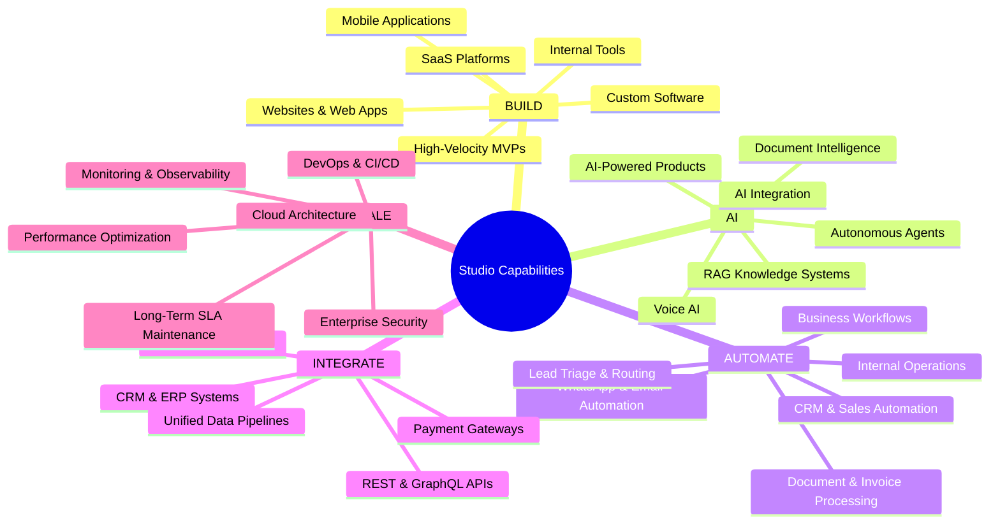

# PROJECT OVERVIEW & STUDIO MASTER CHARTER
**Executive Mandate, Market Positioning, and Evolutionary Roadmap**

---
Document Owner: Principal Project Architect & Systems Planner  
Status: PROPOSED  
Version: 1.0.0  
Last Updated: 2026-09-07  
Dependencies: MASTER PROMPT SPECIFICATION  
Related Documents: [PROJECT_PRINCIPLES.md](file:///d:/Project_website/docs/00-project/PROJECT_PRINCIPLES.md), [DECISION_LOG.md](file:///d:/Project_website/docs/00-project/DECISION_LOG.md), [PROJECT_CONSTRAINTS.md](file:///d:/Project_website/docs/00-project/PROJECT_CONSTRAINTS.md)  
Decision Status: UNDER_REVIEW  
---

## 1. Executive Summary & Company Mandate

We are building a **premium, futuristic, human-centered, AI-native technology company and studio**.

Traditional IT service firms and software agencies operate on outdated, labor-heavy, billable-hours models. They sell technology for technology's sake, forcing client businesses into rigid, pre-packaged off-the-shelf software or bloated custom implementations that fail to align with real business bottlenecks.

This studio is founded on an uncompromising inverse principle:

> **"Technology should adapt to the business — not the business to technology."**

We operate as a **Premium Technology Partner** for ambitious enterprises, combining elite engineering, deep commercial problem-solving, and AI-native automation to deliver compounding leverage.

---

## 2. Core Philosophy & Guiding Tenets

* **Business first.**
* **Technology second.**
* **AI where it creates leverage.**
* **Humans where judgement matters.**

### The Core Promise
> **"We understand the problem before proposing the solution."**

We do not sell features, templates, or tech stacks in isolation. The customer does not need to know whether they require Next.js, Python, PostgreSQL, LangChain, or microservices. They only need to articulate:
1. What they want to achieve.
2. What problem they are facing.
3. What is currently broken or leaking revenue.
4. What manual friction they need removed.

Our mandate is to translate unstructured business language into an authoritative, scalable, and cost-effective technology architecture.

### The North Star
$$\text{Understand the Business} \longrightarrow \text{Translate the Problem} \longrightarrow \text{Build What Matters} \longrightarrow \text{Automate What Shouldn't Be Manual} \longrightarrow \text{Scale What Works}$$

---

## 3. Initial Target Market & Geographic Strategy

* **Target Clientele**:
  - **Startups**: High-growth venture-backed or bootstrapped founders needing bulletproof MVPs, rapid market validation, and AI-powered product differentiators.
  - **SMEs**: Established businesses with proven revenue, burdened by legacy software, manual spreadsheet processes, and disconnected systems.
  - **Growing Businesses & Mid-Market Enterprises**: Companies scaling rapidly, facing operational bottlenecks, requiring custom workflow automation, CRM integrations, and resilient cloud architectures.
* **Geographic Trajectory**:
  - **Primary Launch**: **India** (Leveraging dense startup ecosystems, digital public infrastructure like UPI, and high-velocity SME tech modernization).
  - **Expansion**: **Global** (US, UK, UAE/MENA, Europe, Singapore), offering world-class engineering, design, and AI capabilities at an elite standard.

---

## 4. The 5 Core Capability Pillars



---

## 5. Long-Term Studio Evolution Model

The company is strategically designed to evolve from an elite service firm into an autonomous **AI-Native Technology Studio**:

```
Stage 1: Bespoke Client Services (High-touch consulting, discovery, and custom builds)
  │
  ▼
Stage 2: Reusable Technology & Core Accelerators (Modular internal engines, boilerplates, libraries)
  │
  ▼
Stage 3: Productized Solutions (Packaged workflow solutions tailored for specific verticals)
  │
  ▼
Stage 4: Specialized Vertical SaaS (Proprietary software spun out from repeated business problems)
  │
  ▼
Stage 5: Autonomous Technology Products & Studio IP Ecosystem
```

---

## 6. The Signature Website Concept: AI Project Discovery

The digital front door of the company is **not a brochure**. It is an interactive, consultative diagnostic engine that embodies our core philosophy.

### The Client Journey:
$$\text{Business Problem} \longrightarrow \text{AI Project Discovery} \longrightarrow \text{Problem Understanding} \longrightarrow \text{Opportunity Mapping} \longrightarrow \text{Solution Blueprint} \longrightarrow \text{Indicative Estimation} \longrightarrow \text{Human Review} \longrightarrow \text{Proposal} \longrightarrow \text{Build} \longrightarrow \text{Launch} \longrightarrow \text{Scale}$$

### Primary Calls to Action (CTAs):
* **Primary CTA**: *"Start With Your Problem"* (Launches interactive diagnostic)
* **Secondary CTA**: *"Explore What We Build"* (Demonstrates capability pillars, case studies, and engineering rigor)

---

## 7. Governance & Architectural Boundaries

1. **Human-in-the-Loop Commitment**: While AI dynamically generates Opportunity Maps and preliminary Solution Blueprints, **all commercial quotes, contracts, and architecture commitments require Principal Architect review and sign-off** before becoming legally binding.
2. **Deterministic Stability**: AI is used strictly for cognitive extraction, pattern synthesis, and semantic mapping. Core system state, financial transactions, database persistence, and security controls remain 100% deterministic software.
3. **Traceability**: All business goals (`BR-xxx`) link through product specs (`PR-xxx`), UX designs (`UX-xxx`), technical endpoints (`FR-xxx`), AI schemas (`AI-xxx`), and test suites (`QA-xxx`).
