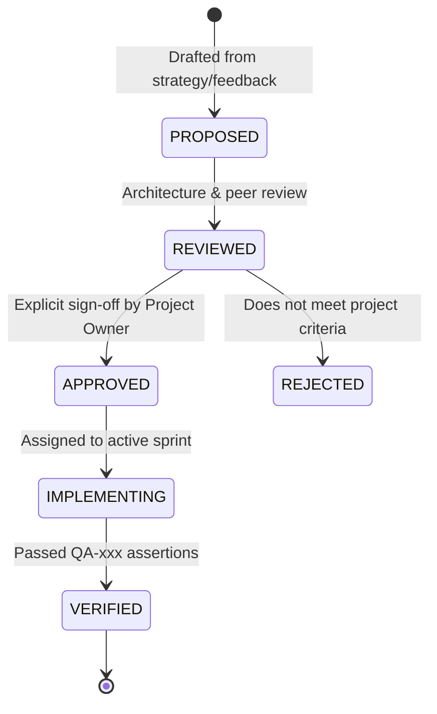

# REQUIREMENTS REGISTER & TRACEABILITY CANON
**Master Framework for System Requirements, Identification Schema, and Lifecycle Governance**

---
Document Owner: Principal Project Architect & Systems Planner  
Status: PROPOSED  
Version: 1.0.0  
Last Updated: 2026-09-07  
Dependencies: [PROJECT_PRINCIPLES.md](file:///d:/Project_website/docs/00-project/PROJECT_PRINCIPLES.md)  
Related Documents: [DEPENDENCY_GRAPH.md](file:///d:/Project_website/docs/00-project/DEPENDENCY_GRAPH.md), [ASSUMPTIONS_REGISTER.md](file:///d:/Project_website/docs/00-project/ASSUMPTIONS_REGISTER.md)  
Decision Status: UNDER_REVIEW  
---

## 1. Canonical Requirement Identifier Taxonomy

Every requirement across the business, product, design, engineering, and operational layers must be assigned a unique, immutable identifier according to this canon:

| Prefix | Category | Definition & Scope | Originating Domain |
| :--- | :--- | :--- | :--- |
| **`BR-xxx`** | Business Requirement | High-level commercial objective, revenue model, market mandate, or legal governance goal. | `01-business/` |
| **`PR-xxx`** | Product Requirement | User-facing capability, feature scope, functional boundary, or workflow definition. | `03-product/`, `04-website/` |
| **`UX-xxx`** | UX/UI Requirement | User interaction standard, accessibility rule, visual ergonomics, or component design behavior. | `05-ux-ui/` |
| **`FR-xxx`** | Functional Requirement | Specific software system behavior, API endpoint, data processing rule, or algorithm output. | `08-architecture/` through `12-api/` |
| **`NFR-xxx`**| Non-Functional Requirement | Performance target, latency threshold, uptime target, availability, or scalability standard. | `08-architecture/`, `16-testing/` |
| **`AI-xxx`** | AI Engine Requirement | Model input/output schema, extraction rule, prompt guardrail, or model routing policy. | `13-ai/`, `14-agents/` |
| **`SEC-xxx`**| Security Requirement | Threat defense, data sanitization, privacy control, encryption standard, or auth policy. | `15-security/` |
| **`QA-xxx`** | Quality Assurance Spec | Automated test case, validation assertion, E2E user flow, or regression test suite. | `16-testing/` |
| **`OPS-xxx`**| Operational Requirement | Internal human procedure, architect review workflow, client onboarding, or SLA process. | `19-operations/` |

---

## 2. Requirement Lifecycle States

1. **PROPOSED**: Requirement identified, awaiting review.
2. **REVIEWED**: Validated against architecture principles and constraints; dependencies mapped.
3. **APPROVED**: Explicitly approved by project owner. Only approved requirements may be implemented.
4. **REJECTED**: Evaluated and discarded (documented with rationale).
5. **IMPLEMENTING**: Active engineering work underway.
6. **VERIFIED**: Automated test or human validation confirms acceptance criteria are met.

---

## 3. Seed Master Requirements Matrix (Core Platform)

### Business Requirements (`BR`)
* **`BR-001`**: The platform must translate unstructured business problems into actionable technology recommendations without requiring the client to understand technical terminology. (Origin: Master Charter)
* **`BR-002`**: The platform must support initial market launch targeting Startups, SMEs, and Growing Businesses in India with future architectural readiness for global markets. (Origin: Master Charter)
* **`BR-003`**: The studio must offer services across 5 capability pillars: BUILD, AI, AUTOMATE, INTEGRATE, and SCALE. (Origin: Master Charter)
* **`BR-004`**: Commercial proposals and binding financial commitments must require human architect review before delivery to clients. (Origin: Master Charter)

### Product Requirements (`PR`)
* **`PR-001`**: The website must provide an interactive AI Project Discovery tool allowing users to describe their business context, problems, constraints, and goals. (Origin: Master Charter)
* **`PR-002`**: The discovery tool must generate an Executive Opportunity Map highlighting operational bottlenecks and high-leverage technology opportunities. (Origin: Master Charter)
* **`PR-003`**: The system must generate a preliminary Solution Blueprint mapping business problems to specific capability pillars. (Origin: Master Charter)
* **`PR-004`**: The website must present 15 core information areas structured across MVP, Phase 2, and Future phases based on value and complexity. (Origin: Master Charter)

### User Experience Requirements (`UX`)
* **`UX-001`**: The website must use a premium, futuristic, human-centered dark-mode aesthetic with custom design tokens and fluid typography. (Origin: Master Charter)
* **`UX-002`**: The AI discovery experience must provide clear visual progress feedback and minimize typing fatigue on mobile devices. (Origin: UX Strategy)
* **`UX-003`**: The user interface must be designed to support WCAG 2.1 Level AA accessibility standards, including keyboard navigability and high-contrast ratios. (Origin: UX Strategy)

### Functional Requirements (`FR`)
* **`FR-001`**: The application must provide an API endpoint to accept discovery inputs and return structured analysis. (Origin: Architecture)
* **`FR-002`**: The backend must persist discovery sessions, user responses, and generated briefs with unique session tokens. (Origin: Database Architecture)
* **`FR-003`**: The system must support lead capture with email validation before delivering full downloadable reports. (Origin: Conversion Strategy)

### Non-Functional Requirements (`NFR`)
* **`NFR-001`**: Marketing pages must achieve optimal Core Web Vitals (target: LCP < 2.5s, INP < 200ms, CLS < 0.1 on standard 4G mobile connections). *Note: Target metric to be empirically validated.* (Origin: SEO Strategy)
* **`NFR-002`**: Architecture must maintain a low operating cost during pre-launch and MVP phases, utilizing free tiers or low-cost infrastructure where appropriate. (Origin: Technology Decision Framework)

### AI Engine Requirements (`AI`)
* **`AI-001`**: AI outputs for problem extraction and opportunity mapping must conform strictly to typed schemas (e.g., Zod schemas) to prevent frontend rendering errors. (Origin: AI Principles)
* **`AI-002`**: The AI architecture must support model routing or multi-provider fallback to mitigate upstream API outages or rate limits. (Origin: AI Architecture)
* **`AI-003`**: The AI engine must be designed with prompt injection defenses to prevent malicious inputs from altering system instructions or extracting prompt templates. (Origin: Security Principles)

### Security Requirements (`SEC`)
* **`SEC-001`**: User inputs must be sanitized on both client and server boundaries before processing or persistence. (Origin: Security Architecture)
* **`SEC-002`**: System must enforce zero model training on client discovery data, utilizing enterprise API endpoints with data retention exclusion agreements. (Origin: Privacy Policy)
* **`SEC-003`**: No environment secrets, database credentials, or API keys may be committed to version control. (Origin: Security Architecture)

### Quality Assurance Requirements (`QA`)
* **`QA-001`**: Core user flows (discovery interaction, lead capture, contact form submission) must be verified via automated end-to-end tests before deployment. (Origin: Testing Strategy)

### Operational Requirements (`OPS`)
* **`OPS-001`**: Proposed customer-facing SLAs (such as proposal review turnaround times) must be validated against real operational capacity before publication. (Origin: Operations Playbook)

---

## 4. Phase 2 Formal Product Requirements Canon (`PRD-REQ-001` through `PRD-REQ-022`)

Detailed specification and rationale for these requirements are codified in [docs/03-product/11-PRODUCT-REQUIREMENTS.md](file:///d:/Project_website/docs/03-product/11-PRODUCT-REQUIREMENTS.md):

| ID | Requirement Summary | Horizon / Priority | Source Decision / Traceability |
| :--- | :--- | :--- | :--- |
| **`PRD-REQ-001`** | Problem-First Natural Language Input | **MVP / Must Have** | `BD-011`, `BD-012`, `BR-001` |
| **`PRD-REQ-002`** | Dynamic Contextual Clarification Questions (3–5 max) | **MVP / Must Have** | `BD-005`, `BD-012`, `PR-001` |
| **`PRD-REQ-003`** | Real-Time Executive Opportunity Map Generation | **MVP / Must Have** | `BD-005`, `PR-002`, `FR-001` |
| **`PRD-REQ-004`** | Comprehensive Solution Blueprint Generation (18 sections) | **MVP / Must Have** | `BD-005`, `PR-003`, `FR-001` |
| **`PRD-REQ-005`** | Non-Binding Indicative Budget & Timeline Estimation Engine | **MVP / Must Have** | `BD-006`, `BD-007`, `NFR-002` |
| **`PRD-REQ-006`** | Value-First Progressive Disclosure & Lead Gating | **MVP / Must Have** | `BD-005`, `FR-003`, `DEC-004` |
| **`PRD-REQ-007`** | Human Architect Review Hand-off & Notification Bridge | **MVP / Must Have** | `BD-010`, `BD-013`, `OPS-001` |
| **`PRD-REQ-008`** | Discovery Data Minimization & Privacy Protection | **MVP / Must Have** | `BD-014`, `SEC-002`, `DEC-013` |
| **`PRD-REQ-009`** | Session Continuity & Magic Link Token Recovery | **MVP / Must Have** | `BD-005`, `FR-002`, `DEC-014` |
| **`PRD-REQ-010`** | Transparent Unknowns & Confidence Explanation Flagging | **MVP / Must Have** | `BD-006`, `BD-010`, `BR-001` |
| **`PRD-REQ-011`** | Anti-Charter Boundary Guardrails & AI Refusal Behavior | **MVP / Must Have** | `BD-010`, `BD-014`, `SEC-003` |
| **`PRD-REQ-012`** | Lean Telemetry & Analytics Instrumentation | **MVP / Should Have** | `NFR-001`, `PR-004` |
| **`PRD-REQ-013`** | Paid Discovery Sprint Transition Gateway (Validation Ready) | **Phase 2 / Should Have** | `BD-004`, `BA-002`, `DEC-002` |
| **`PRD-REQ-014`** | Client Discovery PDF Specification Download | **Phase 2 / Could Have** | `BD-005`, `FR-003`, `DEC-004` |
| **`PRD-REQ-015`** | Admin Triage & Opportunity Pipeline Dashboard | **Phase 2 / Could Have** | `BD-010`, `BD-013`, `OPS-001` |
| **`PRD-REQ-016`** | Multi-Currency Presentation & Localization (INR/USD) | **Phase 2 / Could Have** | `BD-003`, `BR-002`, `DEC-003` |
| **`PRD-REQ-017`** | Authenticated Client Collaboration Portal | **Future / Won't Have (MVP)** | `BD-008`, `DEC-014` |
| **`PRD-REQ-018`** | Automated Proposal & Statement of Work Drafting | **Future / Won't Have (MVP)** | `BD-010`, `BR-004` |
| **`PRD-REQ-019`** | Semantic Vector Solution Retrieval (`pgvector`) | **Future / Won't Have (MVP)** | `BD-015`, `DEC-012` |
| **`PRD-REQ-020`** | Multi-Agent Collaborative Diagnostic Orchestration | **Future / Won't Have (MVP)** | `BD-010`, `DEC-011` |
| **`PRD-REQ-021`** | Integrated Self-Serve Payment Checkout Gateway | **Future / Won't Have (MVP)** | `BD-004`, `DEC-002` |
| **`PRD-REQ-022`** | Automated Boilerplate Scaffolding Engine | **Future / Won't Have (MVP)** | `BD-008` |

---

## 5. Phase 3 Formal Website Requirements Canon (`WEB-REQ-001` through `WEB-REQ-025`)

Detailed specifications and rationale for these requirements are codified in [docs/04-website/17-WEBSITE-REQUIREMENTS.md](file:///d:/Project_website/docs/04-website/17-WEBSITE-REQUIREMENTS.md):

| ID | Requirement Summary | Horizon / Priority | Source Decision / Traceability |
| :--- | :--- | :--- | :--- |
| **`WEB-REQ-001`** | Problem-First Homepage Architecture (9 sections) | **MVP / Must Have** | `BD-011`, `BD-012`, `PRD-REQ-001` |
| **`WEB-REQ-002`** | AI Discovery Stepper Dedicated Route (`/discovery`) | **MVP / Must Have** | `BD-005`, `BD-012`, `PRD-REQ-001` |
| **`WEB-REQ-003`** | Natural Language Problem Input ($\ge 20$ chars, chips) | **MVP / Must Have** | `BD-011`, `PRD-REQ-001` |
| **`WEB-REQ-004`** | Contextual Clarification Branching (3–5 questions) | **MVP / Must Have** | `BD-005`, `PRD-REQ-002` |
| **`WEB-REQ-005`** | Ungated Executive Opportunity Map Rendering (5 categories)| **MVP / Must Have** | `BD-005`, `PRD-REQ-003` |
| **`WEB-REQ-006`** | Progressive Lead Gating for Deep Blueprints & Estimates | **MVP / Must Have** | `BD-005`, `PRD-REQ-006` |
| **`WEB-REQ-007`** | Indicative Planning Sizing Bands (Budget & Timeline) | **MVP / Must Have** | `BD-006`, `PRD-REQ-005` |
| **`WEB-REQ-008`** | Mandatory Non-Binding Estimation Legal Disclaimer | **MVP / Must Have** | `BD-006`, `PRD-REQ-005` |
| **`WEB-REQ-009`** | Human-in-the-Loop Architect Review Bridge (1 business day)| **MVP / Must Have** | `BD-010`, `BD-013`, `PRD-REQ-007` |
| **`WEB-REQ-010`** | Five Dedicated Capability Pillar Pages (`/services/*`) | **MVP / Must Have** | `BD-009`, `BR-003` |
| **`WEB-REQ-011`** | Outcome-Driven Solutions Catalog (`/solutions`) | **MVP / Must Have** | `BD-008`, `BD-009` |
| **`WEB-REQ-012`** | Methodology & Governance Transparency (`/how-we-work`) | **MVP / Must Have** | `BD-010`, `BD-011` |
| **`WEB-REQ-013`** | Direct Enterprise Advisory Inquiry Channel (`/contact`) | **MVP / Must Have** | `BD-013`, `OPS-001` |
| **`WEB-REQ-014`** | Comprehensive Legal & Privacy Pages (`/privacy`, `/terms`)| **MVP / Must Have** | `BD-014`, `PRD-REQ-008` |
| **`WEB-REQ-015`** | Mobile-First Responsive Layout (320px–1440px+) | **MVP / Must Have** | `BD-015`, `UX-002` |
| **`WEB-REQ-016`** | Persistent Mobile Conversion Bar (*"Start Problem"*) | **MVP / Must Have** | `BD-012`, `UX-002` |
| **`WEB-REQ-017`** | WCAG 2.1 Level AA Accessibility & Semantic HTML5 | **MVP / Must Have** | `UX-003`, `PRD-REQ-011` |
| **`WEB-REQ-018`** | Visible High-Contrast Keyboard Focus Indicators (2px) | **MVP / Must Have** | `UX-003` |
| **`WEB-REQ-019`** | Screen Reader Streaming Feedback via `aria-live` | **MVP / Must Have** | `UX-003`, `PRD-REQ-003` |
| **`WEB-REQ-020`** | Anonymous Client Telemetry Event Stream (Zero PII) | **MVP / Should Have** | `BD-014`, `PRD-REQ-012` |
| **`WEB-REQ-021`** | Session Draft Recovery in LocalStorage & URL Token | **MVP / Should Have** | `BD-015`, `PRD-REQ-009` |
| **`WEB-REQ-022`** | FastAPI + Jinja2 Server-Rendered Stack Baseline | **MVP / Must Have** | `BD-015` |
| **`WEB-REQ-023`** | Paid Discovery Sprint Booking Gateway | **Phase 2 / Should Have** | `BD-004`, `PRD-REQ-013` |
| **`WEB-REQ-024`** | Downloadable PDF Architectural Blueprint Export | **Phase 2 / Could Have** | `PRD-REQ-014` |
| **`WEB-REQ-025`** | Authenticated Client Portal Workspace (`/portal`) | **Future / Won't Have (MVP)** | `BD-008`, `PRD-REQ-017` |

