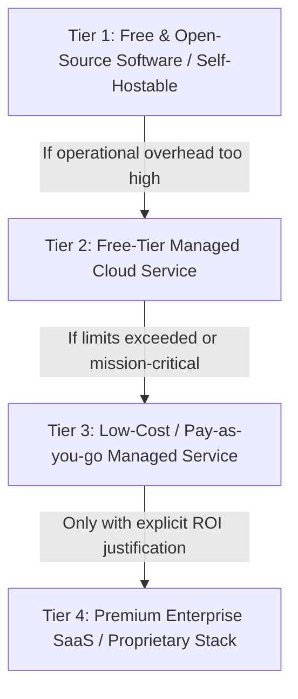

# TECHNOLOGY DECISION FRAMEWORK
**Evaluation Methodology, Cost Governance, and Evidence-Based Selection Canon**

---
Document Owner: Principal Project Architect & Systems Planner  
Status: PROPOSED  
Version: 1.0.0  
Last Updated: 2026-09-07  
Dependencies: [PROJECT_PRINCIPLES.md](file:///d:/Project_website/docs/00-project/PROJECT_PRINCIPLES.md), [PROJECT_CONSTRAINTS.md](file:///d:/Project_website/docs/00-project/PROJECT_CONSTRAINTS.md)  
Related Documents: [DECISION_LOG.md](file:///d:/Project_website/docs/00-project/DECISION_LOG.md)  
Decision Status: UNDER_REVIEW  
---

## 1. Core Principle: Evidence Over Popularity

Technologies must never be selected merely because they are trendy, fashionable on social media, or popular in other companies with fundamentally different business models and scale requirements.

Every technology choice must be justified through rigorous, evidence-based evaluation against:
1. The specific business problem.
2. Verified functional and non-functional requirements.
3. Realistic operational constraints (budget, maintenance capacity, developer velocity).
4. Long-term cost, lock-in, and migration paths.

---

## 2. The Free-First & Cost-Efficiency Hierarchy

To prevent premature burn of capital during MVP and Phase 1, engineering teams must evaluate options through this 4-tier hierarchy before recommending any paid commitment:

### Tier 1: Free & Open-Source / Self-Hostable
- **Rule**: Prioritize robust open-source libraries, standardized protocols (SQL, HTTP, SSE), and software that can run locally or on low-cost generic Linux compute (e.g., Docker, PostgreSQL, Node.js/Python runtimes).
- **Benefit**: Zero license costs, zero vendor lock-in, maximum data sovereignty.

### Tier 2: Free-Tier Managed Services
- **Rule**: Utilize generous, reputable free tiers (e.g., Vercel Hobby/Pro trial, Supabase Free Tier, Cloudflare Free, GitHub Free, Google Cloud / Cloudflare Workers free quotas) for prototyping and MVP launch.
- **Guardrail**: Verify that free-tier limits (bandwidth, invocation count, database connections) will not cause catastrophic service interruption if traffic spikes.

### Tier 3: Pay-As-You-Go / Cost-Linear Cloud Services
- **Rule**: When free tiers are insufficient, select services whose pricing scales strictly with actual usage (e.g., serverless invocations, token usage, per-GB storage) rather than high flat monthly minimums ($500+/month).

### Tier 4: Premium Paid Enterprise SaaS
- **Rule**: Strictly prohibited for MVP unless an explicit business case proves that building or self-hosting would cost $>5\times$ more in direct engineering payroll and delay launch by $>60\text{ days}$.

---

## 3. The 15-Point Technology Evaluation Matrix

Every major technology candidate must be evaluated against these 15 standard criteria before being proposed in `DECISION_LOG.md`:

| Criterion | Evaluation Question |
| :--- | :--- |
| **1. Problem Alignment** | Does this technology solve the exact operational problem without extraneous bloat? |
| **2. Requirements Fit** | Does it satisfy all linked `FR-xxx`, `NFR-xxx`, and `SEC-xxx` requirements? |
| **3. Financial Cost** | What is the total cost at $0$, $1,000$, $10,000$, and $100,000$ monthly active users? |
| **4. Free-Tier Availability** | Does a viable, non-expiring free tier exist for MVP development and initial launch? |
| **5. Vendor Lock-In** | How proprietary is the API/runtime? Can we migrate away without rewriting business logic? |
| **6. Operational Complexity** | How many hours per month will the team spend patching, configuring, and maintaining this? |
| **7. Performance & Latency** | What is the raw latency, cold-start penalty, and runtime memory overhead? |
| **8. Scalability Boundary** | At what exact traffic or data threshold does this architecture break or require replatforming? |
| **9. Developer Experience** | Does it provide type-safety, hot-reloading, comprehensive documentation, and fast test runs? |
| **10. Security Profile** | What is the vulnerability history, patch cadence, and access control model? |
| **11. Data Sovereignty & Privacy** | Where is data physically stored? Does it permit zero-retention and GDPR/DPDP alignment? |
| **12. AI Integration Ergonomics** | How easily does it interface with LLM streaming, token parsers, and vector indices? |
| **13. Ecosystem Maturity** | Is the tool backed by a healthy community, or is it an unmaintained single-maintainer project? |
| **14. Migration Difficulty** | What is the estimated effort (in developer-weeks) to replace this tool if pricing increases $10\times$? |
| **15. Project Stage Fit** | Is this tool appropriate for an MVP studio, or is it premature enterprise overengineering? |

---

## 4. Technology Selection Approval Governance

1. **Evaluation Phase**: Architect evaluates candidates against the 15-point matrix and documents findings in `DECISION_LOG.md`.
2. **Status**: Marked as `[PROPOSED]` or `[DECISION REQUIRED]`.
3. **Recommendation**: Architect provides a clear recommendation with trade-offs.
4. **Project Owner Gate**: Only the Project Owner can transition the status to `[APPROVED]`. Engineers must not commit production code or infrastructure to an unapproved candidate.
