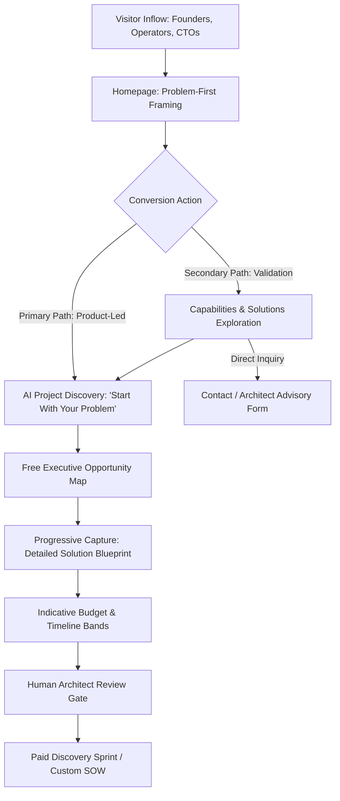

# Website Strategy: The Digital Studio Engine

**Document ID:** `DOC-WEB-001`  
**Classification:** Website Architecture / Phase 3 Strategy  
**Approved Decisions:** [BD-001](file:///d:/Project_website/docs/00-project/DECISION_LOG.md#dec-001), [BD-002](file:///d:/Project_website/docs/00-project/DECISION_LOG.md#dec-002), [BD-003](file:///d:/Project_website/docs/00-project/DECISION_LOG.md#dec-003), [BD-004](file:///d:/Project_website/docs/00-project/DECISION_LOG.md#dec-004), [BD-005](file:///d:/Project_website/docs/00-project/DECISION_LOG.md#dec-005), [BD-006](file:///d:/Project_website/docs/00-project/DECISION_LOG.md#dec-006), [BD-009](file:///d:/Project_website/docs/00-project/DECISION_LOG.md#dec-009), [BD-010](file:///d:/Project_website/docs/00-project/DECISION_LOG.md#dec-010), [BD-011](file:///d:/Project_website/docs/00-project/DECISION_LOG.md#dec-011), [BD-012](file:///d:/Project_website/docs/00-project/DECISION_LOG.md#dec-012)  
**Parent Framework:** [Brand Foundation](file:///d:/Project_website/docs/02-brand/01-BRAND-FOUNDATION.md) | [Brand Narrative](file:///d:/Project_website/docs/02-brand/03-BRAND-NARRATIVE.md) | [Product Vision](file:///d:/Project_website/docs/03-product/01-PRODUCT-VISION.md)  
**Status:** CANONICAL SPECIFICATION  

---

## 1. Executive Summary & Strategic Mandate

The public website of `[STUDIO_NAME]` is **not a passive digital brochure** or marketing static page. It functions as the **primary operating engine** of the studio, fulfilling two tightly coupled strategic roles:

```
┌────────────────────────────────────────────────────────────────────────────────────────┐
│                              THE DUAL MANDATE OF THE WEBSITE                           │
├───────────────────────────────────────────┬────────────────────────────────────────────┤
│         1. TRUST & POSITIONING ANCHOR     │      2. PRODUCT-LED AI DISCOVERY ENGINE    │
│                                           │                                            │
│ • Establishes category leadership as an   │ • Primary CTA: "Start With Your Problem"   │
│   AI-Native Technology Studio (BD-009).   │ • Interactive intake translates natural    │
│ • Validates senior architectural rigor,   │   business language into tech options.     │
│   high-craft delivery, and engineering.   │ • Provides reciprocal diagnostic value     │
│ • Displaces generic agency noise with     │   before requesting contact capture.       │
│   clear problem-first thinking (BD-011).  │ • Drives qualification into human SOW.     │
└───────────────────────────────────────────┴────────────────────────────────────────────┘
```

The core website experience transforms the conventional high-friction sales cycle into a **reciprocal, value-first digital partnership**. Visitors do not need to understand modern cloud infrastructure, multi-agent frameworks, or database normal forms; the website provides the cognitive translation layer that bridges operational business friction to actionable technology assets.

---

## 2. Business Objectives & Sales Funnel Integration

The website is engineered to support the studio's long-term business model (`BD-008`: *Services $\rightarrow$ Reusable Technology $\rightarrow$ Productized Solutions $\rightarrow$ SaaS $\rightarrow$ Products*).

### A. Primary Commercial Objectives
1. **High-Velocity Inbound Qualification**: Screen and qualify inbound prospects from Startups, SMEs, and Growing Businesses (`BD-002`) by capturing structured business context upfront.
2. **Elimination of "Blank Box" Sales Friction**: Replace vague "book a 30-minute discovery call" prompts with an interactive product experience that delivers immediate clarity on problems, opportunities, and indicative timelines.
3. **Pipeline Velocity for Paid Discovery Sprints (`BD-004`)**: Transition high-intent leads into deep, human-led architectural engagements (`HYPOTHESIS — VALIDATION REQUIRED`) with zero reliance on aggressive sales closing tactics.
4. **Positioning Defensibility (`BD-009`, `BD-011`)**: Communicate the philosophy that *"Technology should adapt to the business — not the business to technology"*, setting `[STUDIO_NAME]` apart from legacy hourly agencies and AI wrappers.

### B. Sales Funnel Role Architecture


---

## 3. User Objectives & Mental Models

Target buyers arrive with acute business problems, operational friction, or strategic growth ceilings. Their cognitive needs dictate the user experience:

| User Segment (`BD-002`) | Emotional & Operational State | Primary User Objective on Website | Successful Outcome |
| :--- | :--- | :--- | :--- |
| **Startup Founders** | Resource-constrained, speed-sensitive, uncertain about technical architecture or vendor honesty. | *"I need to build an MVP quickly and cleanly without getting ripped off by an agency."* | Receives a clean technical blueprint, indicative cost bands, and confidence in senior execution. |
| **SME Operators** | Overwhelmed by manual workflows, spreadsheet silos, and legacy systems that don't talk to each other. | *"I need to automate our repetitive bottlenecks without disrupting ongoing operations."* | Sees clear automation opportunities mapped directly to their operational pain points. |
| **Growing Business Leaders** | Modernizing legacy software, facing scalability limits, evaluating AI opportunities. | *"I need a strategic engineering partner who understands business ROI, not just code."* | Validates senior architectural depth, data privacy safeguards, and scalable engineering patterns. |

---

## 4. Trust & Credibility Strategy

Because `[STUDIO_NAME]` enforces an uncompromising standard of integrity (`BR-GDL-003`: *Zero fabricated metrics, logos, or client claims*), trust is established through **radical transparency, intellectual rigor, and demonstrable craftsmanship**:

1. **Process & Architectural Transparency**: Exposing how problems are decomposed and translated builds greater authority than vague generic case studies.
2. **Transparent Estimation with Mandatory Disclaimers (`BD-006`)**: Presenting clear, confidence-banded indicative estimates—while explicitly noting that final contracts require human architect review—signals ethical maturity.
3. **The Human-in-the-Loop Safeguard (`BD-010`)**: Clarifying that *"AI handles leverage, humans handle judgement"* reassures enterprise buyers that their business logic is never blindly delegated to autonomous AI black boxes.
4. **Security & Privacy Posture (`BD-014`)**: Prominently declaring zero-retention enterprise API policies, data minimization, and automated PII masking creates confidence among security-conscious operators.

---

## 5. Conversion Paths & Hierarchy

### A. Primary Conversion Pathway: Product-Led AI Discovery
* **Entry Trigger**: Primary CTA: **"Start With Your Problem"** (`BD-012`).
* **Experience Flow**: Natural Language Problem Input $\rightarrow$ 3–5 Clarification Questions $\rightarrow$ Structured Understanding $\rightarrow$ Real-Time Opportunity Map $\rightarrow$ Progressive Contact Capture $\rightarrow$ Solution Blueprint $\rightarrow$ Indicative Sizing Bands $\rightarrow$ Human Architect Review Request.
* **Conversion Metric**: Qualified Discovery Completion & Blueprint Unlocking.

### B. Secondary Conversion Pathway: Direct Architectural Contact
* **Target User**: High-intent enterprise buyers or procurement officers with predefined RFPs or strict direct-contact preferences.
* **Entry Trigger**: Secondary CTA: **"Talk to an Architect"** / **"Direct Inquiry"**.
* **Experience Flow**: Overview of Capabilities $\rightarrow$ Structured Contact Form $\rightarrow$ Same-Day Architect Triage.

### C. Tertiary Conversion Pathway: Capability Exploration
* **Target User**: Technical evaluators and CTOs assessing stack compatibility.
* **Entry Trigger**: Navigation Links: **"What We Build"** / **"Services"** / **"How We Work"**.
* **Experience Flow**: Outcome-driven capability breakdown $\rightarrow$ Contextual CTA embedded at section end: *"Have a problem in this domain? Start With Your Problem"*.

---

## 6. Strategic Horizon & Future Evolution

| Horizon | Strategic Focus | Website Architectural Role |
| :--- | :--- | :--- |
| **MVP Horizon** | Establishing market positioning, validating diagnostic completion (`BA-001`), capturing initial client discovery briefs. | Lean, lightning-fast Python/Jinja2/HTMX platform with integrated interactive stepper, static content, and zero third-party bloat. |
| **Phase 2 Horizon** | Monetizing Discovery Sprints (`BD-004`, `BA-002`), introducing dynamic multi-currency display (`BD-003`), PDF export. | Expanded diagnostic analytics, downloadable architecture artifacts, structured Discovery Sprint booking gateway. |
| **Future Horizon** | Scaling reusable solution patterns (`BD-008`), launching productized solutions and SaaS assets. | Unified client portal, automated boilerplate scaffolding, interactive solution sandboxes, self-serve client accounts. |

---

## 7. Traceability Canon

* **Originating Decisions**: `BD-001` (Brand), `BD-002` (Segments), `BD-004` (Monetization), `BD-005` (Gating), `BD-006` (Estimation), `BD-009` (Studio Position), `BD-010` (Human+AI), `BD-011` (North Star), `BD-012` (Primary CTA).
* **Downstream Specifications**: Forms the strategic baseline for [Sitemap](file:///d:/Project_website/docs/04-website/02-SITEMAP.md), [Information Architecture](file:///d:/Project_website/docs/04-website/03-INFORMATION-ARCHITECTURE.md), and [Page Specifications](file:///d:/Project_website/docs/04-website/04-PAGE-SPECIFICATIONS.md).
