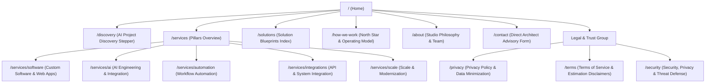

# Website Sitemap & Route Inventory

**Document ID:** `DOC-WEB-002`  
**Classification:** Website Architecture / Phase 3 Sitemap  
**Approved Decisions:** [BD-001](file:///d:/Project_website/docs/00-project/DECISION_LOG.md#dec-001), [BD-002](file:///d:/Project_website/docs/00-project/DECISION_LOG.md#dec-002), [BD-005](file:///d:/Project_website/docs/00-project/DECISION_LOG.md#dec-005), [BD-008](file:///d:/Project_website/docs/00-project/DECISION_LOG.md#dec-008), [BD-012](file:///d:/Project_website/docs/00-project/DECISION_LOG.md#dec-012), [BD-014](file:///d:/Project_website/docs/00-project/DECISION_LOG.md#dec-014), [BD-015](file:///d:/Project_website/docs/00-project/DECISION_LOG.md#dec-015)  
**Parent Framework:** [Website Strategy](file:///d:/Project_website/docs/04-website/01-WEBSITE-STRATEGY.md) | [MVP Scope](file:///d:/Project_website/docs/03-product/08-MVP-SCOPE.md)  
**Status:** CANONICAL SPECIFICATION  

---

## 1. Master Sitemap Topology

---

## 2. Complete Page Inventory & Lifecycle Classification

Every page across the entire web property is evaluated and classified into one of four strict lifecycle horizons:
1. **`MVP`**: Essential for launch, positioning, and the primary discovery conversion engine.
2. **`Phase 2`**: High value but deferred to keep the initial development footprint lean and focused.
3. **`Future`**: Long-term vision (e.g. self-serve SaaS and client portal).
4. **`Not Justified`**: Explicitly rejected to prevent content fluff or unmaintainable bloat.

| Page Name | Canonical Route | Lifecycle Horizon | Primary User Intent & Justification |
| :--- | :--- | :--- | :--- |
| **Home** | `/` | **`MVP`** | Core landing surface. Presents the problem-first value proposition, translation layer, capability pillars, and primary CTA (*"Start With Your Problem"*). |
| **AI Discovery** | `/discovery` | **`MVP`** | Signature interactive engine. 7-stage guided stepper translating business problems into Opportunity Maps, Solution Blueprints, and Indicative Estimates. |
| **Services Overview** | `/services` | **`MVP`** | High-level synthesis of the 5 studio pillars (BUILD, AI, AUTOMATE, INTEGRATE, SCALE). |
| **Service: Software** | `/services/software` | **`MVP`** | Deep dive into full-stack web applications, internal tools, and robust software architecture. |
| **Service: AI** | `/services/ai` | **`MVP`** | AI integration, structured LLM extraction, deterministic reasoning, and enterprise AI workflows. |
| **Service: Automation** | `/services/automation` | **`MVP`** | Process automation, event-driven workflows, and human-in-the-loop task orchestration. |
| **Service: Integrations** | `/services/integrations` | **`MVP`** | API connectors, ERP/CRM synchronization, webhook infrastructure, and legacy bridge systems. |
| **Service: Scale** | `/services/scale` | **`MVP`** | Database performance, legacy system refactoring, modular architecture, and stability engineering. |
| **Solutions Index** | `/solutions` | **`MVP`** | Outcome-driven catalog mapping common industry problems to pre-validated architecture blueprints. |
| **How We Work** | `/how-we-work` | **`MVP`** | Explains the 5-point North Star, AI leverage vs human judgement (`BD-010`), and the 16-stage client journey. |
| **About the Studio** | `/about` | **`MVP`** | Studio origin, core beliefs, engineering culture, and founding team philosophy. |
| **Contact / Advisory** | `/contact` | **`MVP`** | Direct architectural inquiry channel for enterprise buyers with pre-defined requirements or RFPs. |
| **Privacy Policy** | `/privacy` | **`MVP`** | Mandatory legal & trust document detailing zero-training enterprise APIs, data retention, and PII masking (`BD-014`). |
| **Terms of Service** | `/terms` | **`MVP`** | Mandatory commercial governance defining non-binding indicative estimates (`BD-006`) and intellectual property terms. |
| **Security & Privacy** | `/security` | **`MVP`** | Technical trust page explaining the STRIDE threat model, zero-model-training guarantees, and encryption standards. |
| **FAQ** | `/faq` | **`MVP`** *(Section on Home/Contact)* | Answers common operational, pricing, timeline, and discovery questions. Kept as modular components in MVP rather than an isolated thin page. |
| **Case Studies Hub** | `/case-studies` | **`Phase 2`** | Deferred until genuine production engagements yield client-authorized outcomes and empirical metrics (`BR-GDL-003`). |
| **Case Study Detail** | `/case-studies/[slug]` | **`Phase 2`** | In-depth architectural teardowns of client transformations. Requires validated client data. |
| **Insights / Articles** | `/insights` | **`Phase 2`** | Thought leadership on AI architecture, business automation, and engineering patterns. Deferred to avoid unmaintained empty blogs at launch. |
| **Insight Detail** | `/insights/[slug]` | **`Phase 2`** | Long-form technical guides. Requires dedicated editorial cadence. |
| **Discovery Sprint Booking** | `/discovery/book` | **`Phase 2`** | Self-serve scheduling gateway for the Paid Discovery Sprint (`BD-004`), enabled once packaging and pricing are validated. |
| **Client Portal Login** | `/portal/login` | **`Future`** | Secure authenticated dashboard for active project management, deliverable tracking, and milestone reviews (`BD-008`). |
| **Client Portal Dashboard** | `/portal` | **`Future`** | Central workspace for clients to review code repositories, sprint burndowns, and architectural specs. |
| **Careers** | `/careers` | **`Future`** | Dedicated hiring portal. In MVP, recruitment is handled directly through founder networks. |
| **Cookie Policy** | `/cookies` | **`Not Justified`** | The MVP utilizes zero tracking cookies and zero third-party advertising scripts; cookie disclosures are subsumed within `/privacy`. |
| **Free Consultation Page** | `/free-consultation` | **`Not Justified`** | Redundant. The primary consultative entry point is the product-led `/discovery` engine (*"Start With Your Problem"*). |
| **Generic Chatbot Page** | `/chat` | **`Not Justified`** | Open-ended AI chat creates cognitive friction and hallucination risks; superseded by the structured `/discovery` stepper. |

---

## 3. Navigation Anchor Strategy

### A. Primary Header Navigation (Desktop)
* **What We Build** $\rightarrow$ Dropdown linking to `/services` (5 capability pillars) and `/solutions`.
* **How We Work** $\rightarrow$ Links to `/how-we-work`.
* **About** $\rightarrow$ Links to `/about`.
* **Contact** $\rightarrow$ Links to `/contact`.
* **CTA Button (High Emphasis)** $\rightarrow$ **"Start With Your Problem"** (`/discovery`).

### B. Sticky Mobile Navigation Bar
* A persistent bottom bar optimized for 320px–480px touch devices:
  - **Menu** (Drawer trigger: Services, Solutions, About, Contact).
  - **Primary CTA Button** (Full-width prominence): **"Start With Your Problem"** (`/discovery`).

### C. Footer Architecture (4 Columns)
1. **Capabilities (Build & Automate)**: `/services/software`, `/services/ai`, `/services/automation`, `/services/integrations`, `/services/scale`.
2. **Outcomes & Approach**: `/solutions`, `/how-we-work`, `/about`.
3. **AI Discovery Engine**: `/discovery` (*"Start With Your Problem"*), `/contact`.
4. **Trust & Governance**: `/privacy`, `/terms`, `/security`, Copyright `[STUDIO_NAME]`.

---

## 4. Architectural Constraints & SEO Routing Discipline

1. **Clean Semantic Slugs**: All URLs are human-readable, lowercase, kebab-cased, and without file extensions (e.g. `/services/software` not `/services_software.html`).
2. **FastAPI Route Mapping**: Every route maps directly to a FastAPI server-side rendered view (`get_home_page`, `get_discovery_stepper`, `get_service_detail`, etc.) served via Jinja2 templates (`BD-015`).
3. **Strict Trailing Slash Normalization**: The application enforces uniform URL resolution (redirecting `/services/` $\rightarrow$ `/services`) to prevent search engine canonical duplication.
