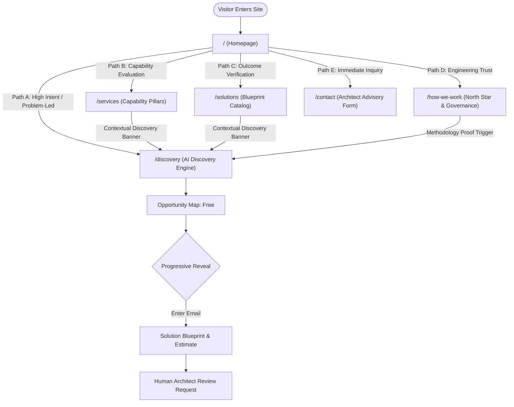

# Website UX Architecture & User Journey Canon

**Document ID:** `DOC-WEB-005`  
**Classification:** Website Architecture / Phase 3 UX Architecture  
**Approved Decisions:** [BD-001](file:///d:/Project_website/docs/00-project/DECISION_LOG.md#dec-001), [BD-002](file:///d:/Project_website/docs/00-project/DECISION_LOG.md#dec-002), [BD-005](file:///d:/Project_website/docs/00-project/DECISION_LOG.md#dec-005), [BD-010](file:///d:/Project_website/docs/00-project/DECISION_LOG.md#dec-010), [BD-011](file:///d:/Project_website/docs/00-project/DECISION_LOG.md#dec-011), [BD-012](file:///d:/Project_website/docs/00-project/DECISION_LOG.md#dec-012), [BD-015](file:///d:/Project_website/docs/00-project/DECISION_LOG.md#dec-015)  
**Parent Framework:** [Website Strategy](file:///d:/Project_website/docs/04-website/01-WEBSITE-STRATEGY.md) | [Information Architecture](file:///d:/Project_website/docs/04-website/03-INFORMATION-ARCHITECTURE.md)  
**Status:** CANONICAL SPECIFICATION  

---

## 1. UX Architectural Philosophy & Principles

The user experience of `[STUDIO_NAME]` is engineered to feel **calm, intelligent, authoritative, and frictionless**. It rejects the anxious visual clutter, over-animated fluff, and dark patterns common in modern agency websites:

1. **Cognitive Calm & Clarity**: High information density presented with generous negative space, structured typography, and clear visual hierarchy.
2. **Zero Form Fatigue**: The user never encounters an intimidating, open-ended 15-field software specification form. All interactions are broken down into digestible, progressive cognitive steps.
3. **Reciprocal Value Precedence**: The user receives real-time analytical synthesis and an Executive Opportunity Map *before* being prompted for contact details.
4. **State & Progress Preservation**: If a user leaves the discovery flow midway or switches tabs, their context is preserved via local browser session storage (`BD-015`).

---

## 2. Visitor Archetypes & Cognitive States

```
┌────────────────────────────────────────────────────────────────────────────────────────┐
│                                VISITOR ARCHETYPE MATRIX                                │
├───────────────────────┬────────────────────────────┬───────────────────────────────────┤
│ ARCHETYPE             │ COGNITIVE / EMOTIONAL STATE│ OPTIMAL CONVERSION PATHWAY        │
├───────────────────────┼────────────────────────────┼───────────────────────────────────┤
│ Non-Technical Founder │ Anxious about tech debt,   │ Path A: Home ➔ AI Discovery       │
│ (Startup Segment)     │ cost ambiguity, and speed. │ (Direct problem intake)           │
├───────────────────────┼────────────────────────────┼───────────────────────────────────┤
│ Operational Leader    │ Frustrated by manual data  │ Path B: Home ➔ Services ➔         │
│ (SME Segment)         │ entry and tool silos.      │ AI Discovery (Capability context) │
├───────────────────────┼────────────────────────────┼───────────────────────────────────┤
│ Growth CTO / Architect│ Skeptical of AI buzzwords; │ Path D: Home ➔ How We Work ➔      │
│ (Growing Business)    │ verifies engineering rigor.│ Contact (Methodology & dialogue)  │
├───────────────────────┼────────────────────────────┼───────────────────────────────────┤
│ High-Intent Buyer     │ Has an active project, RFP,│ Path E: Home ➔ Direct Advisory    │
│ (Enterprise / Agency) │ or immediate budget.       │ Contact form                      │
├───────────────────────┼────────────────────────────┼───────────────────────────────────┤
│ Research Visitor      │ Comparing multiple studio  │ Path C: Home ➔ Solutions Index ➔  │
│ (Early Explorer)      │ partners & models.         │ AI Discovery bookmarking          │
└───────────────────────┴────────────────────────────┴───────────────────────────────────┘
```

---

## 3. Core User Navigation Paths



### Path A: Direct Problem-Led Journey (Home $\rightarrow$ AI Discovery)
* **Objective**: Rapidly convert visitors who arrive with an immediate, acute operational problem.
* **Journey Mechanics**:
  1. *Hero View*: Visitor absorbs the headline: *"Have a business problem? Let's turn it into technology."*
  2. *Action*: Visitor clicks primary CTA: **"Start With Your Problem"** (`/discovery`).
  3. *Experience*: Seamless transition into the 7-stage guided discovery stepper.
  4. *Resolution*: Generates an actionable Opportunity Map in $<120$ seconds, prompting value-first contact capture to unlock the detailed Solution Blueprint and indicative budget range.

### Path B: Capability-Led Journey (Home $\rightarrow$ Services $\rightarrow$ AI Discovery)
* **Objective**: Convince pragmatic evaluators who want to verify specific technical capabilities before committing their problem context.
* **Journey Mechanics**:
  1. *Exploration*: Visitor navigates from Home to `/services` or a specific pillar (e.g. `/services/automation`).
  2. *Deep Dive*: Reviews architectural capabilities, asynchronous pipelines, and systems integration patterns.
  3. *Conversion Bridge*: Encounters mid-page diagnostic trigger: *"Wondering how automation applies to your operational bottlenecks?"*
  4. *Action*: Clicks **"Diagnose Automation Bottlenecks"**, landing directly in `/discovery?topic=automation` with pre-selected context.

### Path C: Outcome-Led Journey (Home $\rightarrow$ Solutions $\rightarrow$ AI Discovery)
* **Objective**: Guide visitors looking for proof that `[STUDIO_NAME]` solves their specific business challenge (e.g. ERP integration or invoice extraction).
* **Journey Mechanics**:
  1. *Exploration*: Visitor navigates to `/solutions`.
  2. *Evaluation*: Reviews pre-engineered solution architectures matching their industry challenge.
  3. *Conversion Bridge*: Each blueprint card features an action: *"Calculate project scope for this blueprint"*.
  4. *Action*: Launches discovery stepper pre-seeded with that solution pattern.

### Path D: Methodology & Trust Journey (Home $\rightarrow$ How We Work $\rightarrow$ Contact / Discovery)
* **Objective**: Satisfy risk-averse technical leaders, CTOs, and enterprise executives who prioritize governance, code ownership, and team structure.
* **Journey Mechanics**:
  1. *Exploration*: Visitor navigates to `/how-we-work`.
  2. *Verification*: Reads the 5-point North Star, the Human-AI Collaboration Law (`BD-010`), and code ownership terms.
  3. *Validation*: Reviews `/security` to confirm enterprise zero-training API policies (`BD-014`).
  4. *Action*: Highly confident, the visitor either launches `/discovery` or submits `/contact` for an executive architecture session.

### Path E: Direct Enterprise Inquiry (Home $\rightarrow$ Contact)
* **Objective**: Provide an unhindered, expedited channel for corporate buyers with pre-drafted RFPs or non-disclosure agreements (NDAs) who bypass automated tooling.
* **Journey Mechanics**:
  1. *Action*: Visitor clicks **"Contact"** in the top navigation or footer.
  2. *Intake*: Submits a clean, 4-field inquiry form.
  3. *Expectation Management*: Confirmation screen displays transparent policy: *"Inquiries are triaged by senior technical architects within 1 business day."* (`BD-013`).

---

## 4. State Management, Session Continuity & Error Recovery

1. **Anonymous Local Storage**: Diagnostic responses (Problem description, answers, selected options) are continuously synchronized to `localStorage` under key `studio_discovery_draft`.
2. **Tab Continuity & Reload Resilience**: If a user accidentally refreshes the browser during Stage 2 or 3, their state is restored without data loss.
3. **Graceful Degradation & Network Drops**: In the event of a client-side network disconnect during AI processing, the UI presents an accessible retry trigger: *"Connection interrupted. [Retry synthesis]"* without wiping user input.
4. **Back / Edit Ergonomics**: Stepper navigation allows non-destructive backward movement; users can edit previous answers without resetting generated analyses.
