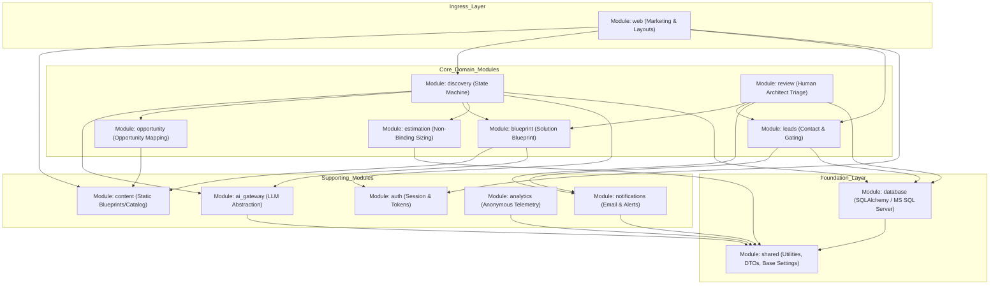

# Modular Monolith Architecture & Subsystem Boundaries

**Document ID:** `DOC-ARCH-003`  
**Classification:** System Architecture / Phase 4 Module Boundaries  
**Approved Decisions:** [BD-001](file:///d:/Project_website/docs/00-project/DECISION_LOG.md#dec-001), [BD-005](file:///d:/Project_website/docs/00-project/DECISION_LOG.md#dec-005), [BD-006](file:///d:/Project_website/docs/00-project/DECISION_LOG.md#dec-006), [BD-010](file:///d:/Project_website/docs/00-project/DECISION_LOG.md#dec-010), [BD-015](file:///d:/Project_website/docs/00-project/DECISION_LOG.md#dec-015), [CST-CNF-007](file:///d:/Project_website/docs/00-project/PROJECT_CONSTRAINTS.md#cst-cnf-007)  
**Parent Framework:** [System Architecture](file:///d:/Project_website/docs/05-architecture/01-SYSTEM-ARCHITECTURE.md) | [ADR-001](file:///d:/Project_website/docs/05-architecture/02-ARCHITECTURE-DECISION-RECORDS.md#adr-001)  
**Status:** CANONICAL SPECIFICATION  

---

## 1. Modular Monolith Architecture Principles

To achieve enterprise software maintainability within a single codebase, `[STUDIO_NAME]` enforces a **strict modular boundary architecture**:

1. **High Cohesion, Loose Coupling**: Each module encapsulates a single business capability. Modules communicate via explicit public interfaces or internal domain events.
2. **Data Ownership Encapsulation**: Only the owning module may directly read or mutate its database tables. Other modules must request data through the owner's public service contract.
3. **Strict Acyclic Dependency Graph**: Dependencies must flow in a single direction. Circular dependencies between modules are strictly forbidden and enforced via static linting.
4. **Zero Cross-Module Direct Model Leakage**: Modules return typed Pydantic Data Transfer Objects (DTOs), never raw SQLAlchemy internal database model instances.

---

## 2. Module Dependency Graph

---

## 3. Comprehensive Module Specifications

---

### Module 01: `web` (Public Website & Views)
* **Responsibility**: Serving server-rendered marketing pages, handling top-level layout rendering, routing public requests, injecting SEO metadata, and serving static assets.
* **Inputs**: Incoming HTTP GET requests from browsers.
* **Outputs**: Server-rendered Jinja2 HTML templates.
* **Owned Data Entities**: None (Stateless presentation layer).
* **Dependencies**: `content`, `auth`, `shared`.
* **Public Interface**: FastAPI route handlers (`/`, `/services/*`, `/solutions`, `/how-we-work`, `/about`, `/contact`).
* **Forbidden Dependencies**: `ai_gateway`, `database` (Direct SQL queries), `estimation` (Direct sizing calculations).

---

### Module 02: `discovery` (AI Project Discovery Engine)
* **Responsibility**: Orchestrating the 7-stage diagnostic state machine; coordinating problem intake, clarification questions, opportunity mapping, and blueprint generation.
* **Inputs**: User problem descriptions, question responses, session tokens.
* **Outputs**: Structured diagnostic stages, HTMX HTML partials, session state updates.
* **Owned Data Entities**: `DiscoverySession`, `DiscoveryStage`, `ProblemStatement`.
* **Dependencies**: `ai_gateway`, `opportunity`, `blueprint`, `estimation`, `auth`, `database`, `shared`.
* **Public Interface**: `DiscoveryService.start_session()`, `DiscoveryService.submit_problem()`, `DiscoveryService.submit_answers()`, `DiscoveryService.get_session_state()`.
* **Forbidden Dependencies**: `leads` (Direct mutation; uses lead module interfaces), `web`.

---

### Module 03: `opportunity` (Opportunity Mapping Engine)
* **Responsibility**: Classifying business friction into 5 opportunity categories (Quick Wins, Core Builds, Automation, Integrations, System Risks); ranking impact and complexity.
* **Inputs**: Structured problem context and user question answers.
* **Outputs**: List of `OpportunityDTO` items.
* **Owned Data Entities**: `Opportunity`, `OpportunityCategory`.
* **Dependencies**: `content`, `shared`.
* **Public Interface**: `OpportunityService.synthesize_opportunities(context: ProblemContextDTO) -> List[OpportunityDTO]`.
* **Forbidden Dependencies**: `ai_gateway` (Direct LLM calls; uses Discovery coordinator), `leads`, `notifications`.

---

### Module 04: `blueprint` (Solution Blueprint Engine)
* **Responsibility**: Assembling the comprehensive 18-section architectural blueprint, combining pre-validated studio patterns with custom client requirements.
* **Inputs**: Validated opportunity map and operational context.
* **Outputs**: `SolutionBlueprintDTO` containing all 18 sections with explicit AI-draft vs Human-approved status flags.
* **Owned Data Entities**: `SolutionBlueprint`, `BlueprintSection`.
* **Dependencies**: `content`, `ai_gateway`, `shared`.
* **Public Interface**: `BlueprintService.generate_draft_blueprint(session_id: UUID) -> SolutionBlueprintDTO`.
* **Forbidden Dependencies**: `leads`, `estimation`.

---

### Module 05: `estimation` (Indicative Sizing Engine)
* **Responsibility**: Calculating confidence-banded budget and timeline ranges based on input complexity signals (`BD-006`); formatting the mandatory legal disclaimer.
* **Inputs**: Complexity factors, integration counts, data volume signals.
* **Outputs**: `EstimateDTO` with low-to-high budget/duration bands and confidence ratings.
* **Owned Data Entities**: `Estimate`, `EstimateFactor`.
* **Dependencies**: `shared`.
* **Public Interface**: `EstimationService.calculate_indicative_estimate(factors: List[ComplexityFactor]) -> EstimateDTO`.
* **Forbidden Dependencies**: `ai_gateway` (Estimation is deterministic algorithm, not unconstrained AI hallucinations), `leads`.

---

### Module 06: `leads` (Lead Capture & Gating)
* **Responsibility**: Enforcing progressive reveal gates (`BD-005`); validating email formats; recording consent timestamps; elevating anonymous sessions.
* **Inputs**: Full Name, Corporate Email, Company Name, Session Token, Consent flag.
* **Outputs**: `LeadDTO`, Session Elevation confirmation.
* **Owned Data Entities**: `Lead`, `LeadConsent`.
* **Dependencies**: `notifications`, `database`, `shared`.
* **Public Interface**: `LeadService.capture_lead(data: LeadCaptureInput) -> LeadDTO`.
* **Forbidden Dependencies**: `ai_gateway`, `opportunity`, `blueprint`.

---

### Module 07: `review` (Human Architect Triage & Handoff)
* **Responsibility**: Managing the human-in-the-loop review queue (`BD-010`); recording architect evaluation notes; signing off on formal SOW feasibility.
* **Inputs**: Client review requests, architect review notes.
* **Outputs**: `ReviewRequestDTO`, status updates.
* **Owned Data Entities**: `ReviewRequest`, `ReviewDecision`.
* **Dependencies**: `blueprint`, `leads`, `notifications`, `database`, `shared`.
* **Public Interface**: `ReviewService.submit_review_request(session_id: UUID) -> ReviewRequestDTO`.
* **Forbidden Dependencies**: `web`, `ai_gateway`.

---

### Module 08: `ai_gateway` (AI Provider Abstraction)
* **Responsibility**: Standardizing LLM calls across providers; enforcing strict Pydantic structured extraction; managing retries, timeouts, and zero-retention policies (`BD-014`).
* **Inputs**: System prompts, user inputs, Pydantic target schemas.
* **Outputs**: Validated Pydantic schema instances.
* **Owned Data Entities**: None (Stateless gateway).
* **Dependencies**: `shared`.
* **Public Interface**: `AIGateway.extract_structured_data(prompt: str, schema: Type[T]) -> T`.
* **Forbidden Dependencies**: `database`, `web`, `leads`.

---

### Module 09: `notifications` (Asynchronous Alerts)
* **Responsibility**: Dispatching blueprint confirmation emails to clients and notifying senior architects of new review requests via FastAPI `BackgroundTasks`.
* **Inputs**: Email templates, recipient addresses, payload dictionaries.
* **Outputs**: Background task execution.
* **Owned Data Entities**: `NotificationLog`.
* **Dependencies**: `shared`.
* **Public Interface**: `NotificationService.send_blueprint_email(lead: LeadDTO, blueprint: SolutionBlueprintDTO)`.
* **Forbidden Dependencies**: `ai_gateway`, `discovery`.

---

### Module 10: `auth` (Identity & Session Management)
* **Responsibility**: Issuing cryptographically signed anonymous session cookies; generating magic link tokens; validating session continuity.
* **Inputs**: HTTP requests, cookies, magic link tokens.
* **Outputs**: Validated `SessionIdentityDTO`.
* **Owned Data Entities**: None (Cryptographic signed tokens).
* **Dependencies**: `shared`.
* **Public Interface**: `AuthService.get_or_create_session(request: Request) -> SessionIdentityDTO`.
* **Forbidden Dependencies**: `discovery`, `leads`.

---

### Module 11: `content` (Static Solutions & Services Catalog)
* **Responsibility**: Storing and serving pre-validated studio solution blueprints and service pillar models from memory.
* **Inputs**: Pillar slugs, solution IDs.
* **Outputs**: `ServicePillarDTO`, `SolutionBlueprintTemplateDTO`.
* **Owned Data Entities**: In-memory static catalogs (`BD-015`).
* **Dependencies**: `shared`.
* **Public Interface**: `ContentService.get_all_pillars()`, `ContentService.get_solution_templates()`.
* **Forbidden Dependencies**: `database`, `ai_gateway`.

---

### Module 12: `database` (Data Persistence & Migrations)
* **Responsibility**: Managing SQLAlchemy session lifecycles, connection pooling to Microsoft SQL Server (`CST-CNF-008`), and executing Alembic migrations.
* **Inputs**: Database configuration settings.
* **Outputs**: Thread-safe database sessions (`AsyncSession` or `Session`).
* **Owned Data Entities**: Global connection pool.
* **Dependencies**: `shared`.
* **Public Interface**: `get_db_session()`, `Base` (SQLAlchemy Declarative Base).
* **Forbidden Dependencies**: All domain modules.

---

### Module 13: `shared` (Core Foundation)
* **Responsibility**: Housing global application settings (`pydantic-settings`), logging configurations, base exceptions, and universal value types.
* **Inputs**: Environment variables.
* **Outputs**: Universal application configuration and utilities.
* **Owned Data Entities**: None.
* **Dependencies**: Standard library, Pydantic.
* **Forbidden Dependencies**: All application domain modules.
