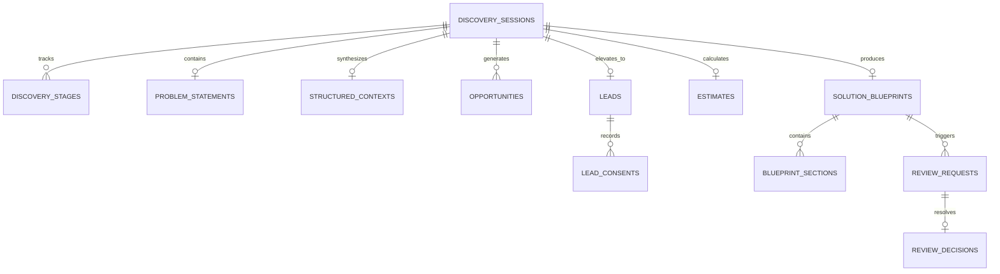

# Database Schema Specification & Relational Entity Canon

**Document ID:** `DOC-ARCH-006`  
**Classification:** Database Architecture / Phase 4 Entity Specification  
**Approved Decisions:** [BD-001](file:///d:/Project_website/docs/00-project/DECISION_LOG.md#dec-001), [BD-005](file:///d:/Project_website/docs/00-project/DECISION_LOG.md#dec-005), [BD-006](file:///d:/Project_website/docs/00-project/DECISION_LOG.md#dec-006), [BD-010](file:///d:/Project_website/docs/00-project/DECISION_LOG.md#dec-010), [BD-014](file:///d:/Project_website/docs/00-project/DECISION_LOG.md#dec-014), [BD-015](file:///d:/Project_website/docs/00-project/DECISION_LOG.md#dec-015), [CST-CNF-008](file:///d:/Project_website/docs/00-project/PROJECT_CONSTRAINTS.md#cst-cnf-008)  
**Parent Framework:** [Database Architecture](file:///d:/Project_website/docs/05-architecture/05-DATABASE-ARCHITECTURE.md) | [Data Flow Architecture](file:///d:/Project_website/docs/05-architecture/07-DATA-FLOW-ARCHITECTURE.md)  
**Status:** CANONICAL SPECIFICATION  

---

## 1. Schema Overview & Entity Relationship Diagram

---

## 2. Core Relational Entities Specification

---

### Entity 01: `dbo.discovery_sessions`
* **Purpose**: Root aggregate tracking the complete user diagnostic session from anonymous entry to lead capture and review request.
* **Fields**:
  - `id`: `UNIQUEIDENTIFIER PRIMARY KEY` (UUID4).
  - `session_token_hash`: `NVARCHAR(64) NOT NULL UNIQUE` (SHA-256 hash of the client cookie token).
  - `current_stage`: `NVARCHAR(32) NOT NULL DEFAULT 'START'` (State machine status).
  - `is_unlocked`: `BIT NOT NULL DEFAULT 0` (True if lead gate completed).
  - `lead_id`: `UNIQUEIDENTIFIER NULL` (Foreign key to `dbo.leads(id)`).
  - `created_at`: `DATETIMEOFFSET NOT NULL DEFAULT GETUTCDATE()`.
  - `updated_at`: `DATETIMEOFFSET NOT NULL DEFAULT GETUTCDATE()`.
  - `is_deleted`: `BIT NOT NULL DEFAULT 0`.
* **Indexes**: `IX_discovery_sessions_token (session_token_hash)`.
* **Retention Architecture**: Unlocked sessions retained for active client relationship; uncompleted anonymous sessions purged via scheduled sweeper in accordance with ratified data retention policy (`POLICY DECISION REQUIRED`).

---

### Entity 02: `dbo.problem_statements`
* **Purpose**: Stores the client's raw natural language problem description along with sanitization metadata.
* **Fields**:
  - `id`: `UNIQUEIDENTIFIER PRIMARY KEY`.
  - `session_id`: `UNIQUEIDENTIFIER NOT NULL UNIQUE` (FK to `dbo.discovery_sessions(id)`).
  - `raw_text`: `NVARCHAR(MAX) NOT NULL` (User-submitted business problem text).
  - `sanitized_text`: `NVARCHAR(MAX) NOT NULL` (PII-scrubbed problem text passed to AI gateway).
  - `character_count`: `INT NOT NULL`.
  - `created_at`: `DATETIMEOFFSET NOT NULL DEFAULT GETUTCDATE()`.
* **Sensitive Data Note**: Scrubbed for credit cards, passwords, and personal identifiers prior to persistence (`BD-014`).

---

### Entity 03: `dbo.structured_contexts`
* **Purpose**: Persists the AI-generated operational problem synthesis, clarification responses, and identified system unknowns.
* **Fields**:
  - `id`: `UNIQUEIDENTIFIER PRIMARY KEY`.
  - `session_id`: `UNIQUEIDENTIFIER NOT NULL UNIQUE` (FK to `dbo.discovery_sessions(id)`).
  - `clarification_answers`: `NVARCHAR(MAX) NOT NULL` (JSON array of question-answer pairs).
  - `core_challenge`: `NVARCHAR(500) NOT NULL` (Summarized operational bottleneck).
  - `impacted_workflows`: `NVARCHAR(MAX) NOT NULL` (JSON array of workflow strings).
  - `flagged_unknowns`: `NVARCHAR(MAX) NOT NULL` (JSON array of flagged unknown risks).
  - `complexity_tier`: `NVARCHAR(32) NOT NULL` (`'LOW'`, `'MEDIUM'`, `'HIGH'`).
  - `created_at`: `DATETIMEOFFSET NOT NULL DEFAULT GETUTCDATE()`.

---

### Entity 04: `dbo.opportunities`
* **Purpose**: Discrete technology, automation, or integration opportunity nodes presented in the Executive Opportunity Map.
* **Fields**:
  - `id`: `UNIQUEIDENTIFIER PRIMARY KEY`.
  - `session_id`: `UNIQUEIDENTIFIER NOT NULL` (FK to `dbo.discovery_sessions(id)`).
  - `category`: `NVARCHAR(64) NOT NULL` (`'QUICK_WIN'`, `'CORE_BUILD'`, `'AUTOMATION'`, `'INTEGRATION'`, `'SYSTEM_RISK'`).
  - `title`: `NVARCHAR(255) NOT NULL`.
  - `description`: `NVARCHAR(MAX) NOT NULL`.
  - `business_impact`: `NVARCHAR(32) NOT NULL` (`'HIGH'`, `'MEDIUM'`, `'LOW'`).
  - `technical_complexity`: `NVARCHAR(32) NOT NULL` (`'HIGH'`, `'MEDIUM'`, `'LOW'`).
  - `estimated_effort_weeks`: `NVARCHAR(64) NOT NULL` (e.g. `'2 – 3 Weeks'`).
  - `created_at`: `DATETIMEOFFSET NOT NULL DEFAULT GETUTCDATE()`.
* **Indexes**: `IX_opportunities_session_id (session_id)`.

---

### Entity 05: `dbo.solution_blueprints`
* **Purpose**: Master entity for the 18-section architectural blueprint synthesized for the client brief.
* **Fields**:
  - `id`: `UNIQUEIDENTIFIER PRIMARY KEY`.
  - `session_id`: `UNIQUEIDENTIFIER NOT NULL UNIQUE` (FK to `dbo.discovery_sessions(id)`).
  - `blueprint_version`: `INT NOT NULL DEFAULT 1`.
  - `recommended_stack_category`: `NVARCHAR(128) NOT NULL` (e.g. `'Python / FastAPI / Asynchronous Pipelines'`).
  - `executive_summary`: `NVARCHAR(MAX) NOT NULL`.
  - `status`: `NVARCHAR(32) NOT NULL DEFAULT 'DRAFT'` (`'DRAFT'`, `'REVIEWED'`, `'APPROVED'`).
  - `is_architect_endorsed`: `BIT NOT NULL DEFAULT 0` (`BD-010`).
  - `created_at`: `DATETIMEOFFSET NOT NULL DEFAULT GETUTCDATE()`.
  - `updated_at`: `DATETIMEOFFSET NOT NULL DEFAULT GETUTCDATE()`.

---

### Entity 06: `dbo.blueprint_sections`
* **Purpose**: Individual sections of the 18-section Solution Blueprint (Architecture, Data Models, Integrations, Security).
* **Fields**:
  - `id`: `UNIQUEIDENTIFIER PRIMARY KEY`.
  - `blueprint_id`: `UNIQUEIDENTIFIER NOT NULL` (FK to `dbo.solution_blueprints(id)`).
  - `section_index`: `INT NOT NULL` (1 to 18).
  - `section_key`: `NVARCHAR(64) NOT NULL` (e.g. `'target_state_vision'`, `'security_considerations'`).
  - `section_title`: `NVARCHAR(255) NOT NULL`.
  - `content_markdown`: `NVARCHAR(MAX) NOT NULL`.
  - `is_human_reviewed`: `BIT NOT NULL DEFAULT 0`.
* **Indexes**: `IX_blueprint_sections_blueprint_id (blueprint_id, section_index)`.

---

### Entity 07: `dbo.estimates`
* **Purpose**: Stores automated indicative budget and timeline planning calculations accompanied by non-binding disclaimers (`BD-006`).
* **Fields**:
  - `id`: `UNIQUEIDENTIFIER PRIMARY KEY`.
  - `session_id`: `UNIQUEIDENTIFIER NOT NULL UNIQUE` (FK to `dbo.discovery_sessions(id)`).
  - `budget_min_inr`: `DECIMAL(12, 2) NOT NULL`.
  - `budget_max_inr`: `DECIMAL(12, 2) NOT NULL`.
  - `budget_min_usd`: `DECIMAL(10, 2) NOT NULL`.
  - `budget_max_usd`: `DECIMAL(10, 2) NOT NULL`.
  - `timeline_min_weeks`: `INT NOT NULL`.
  - `timeline_max_weeks`: `INT NOT NULL`.
  - `confidence_rating`: `NVARCHAR(32) NOT NULL` (`'LOW'`, `'MEDIUM'`, `'HIGH'`).
  - `sizing_factors_json`: `NVARCHAR(MAX) NOT NULL` (Audit trail of algorithmic inputs).
  - `mandatory_disclaimer`: `NVARCHAR(MAX) NOT NULL` (Immutable snapshot of the legal disclaimer).
  - `created_at`: `DATETIMEOFFSET NOT NULL DEFAULT GETUTCDATE()`.

---

### Entity 08: `dbo.leads`
* **Purpose**: Stores verified commercial contact details captured at the progressive reveal gate (`BD-005`).
* **Fields**:
  - `id`: `UNIQUEIDENTIFIER PRIMARY KEY`.
  - `full_name`: `NVARCHAR(255) NOT NULL`.
  - `corporate_email`: `NVARCHAR(255) NOT NULL`.
  - `company_name`: `NVARCHAR(255) NULL`.
  - `phone_number`: `NVARCHAR(64) NULL` (Optional).
  - `ip_country_code`: `NVARCHAR(8) NULL` (Derived from request headers).
  - `lead_status`: `NVARCHAR(32) NOT NULL DEFAULT 'NEW'` (`'NEW'`, `'CONTACTED'`, `'QUALIFIED'`, `'CONVERTED'`).
  - `created_at`: `DATETIMEOFFSET NOT NULL DEFAULT GETUTCDATE()`.
* **Indexes**: `IX_leads_email (corporate_email)`.

---

### Entity 09: `dbo.lead_consents`
* **Purpose**: Legal compliance entity recording explicit consent timestamps and policies accepted by the lead (`BD-014`).
* **Fields**:
  - `id`: `UNIQUEIDENTIFIER PRIMARY KEY`.
  - `lead_id`: `UNIQUEIDENTIFIER NOT NULL` (FK to `dbo.leads(id)`).
  - `consent_type`: `NVARCHAR(64) NOT NULL DEFAULT 'BLUEPRINT_DELIVERY'`.
  - `consent_text`: `NVARCHAR(MAX) NOT NULL`.
  - `granted_at`: `DATETIMEOFFSET NOT NULL DEFAULT GETUTCDATE()`.
  - `ip_address_hash`: `NVARCHAR(64) NOT NULL` (Hashed for audit without raw IP storage).

---

### Entity 10: `dbo.review_requests`
* **Purpose**: Tracks human architect evaluation requests initiated by clients (`BD-010`).
* **Fields**:
  - `id`: `UNIQUEIDENTIFIER PRIMARY KEY`.
  - `session_id`: `UNIQUEIDENTIFIER NOT NULL` (FK to `dbo.discovery_sessions(id)`).
  - `lead_id`: `UNIQUEIDENTIFIER NOT NULL` (FK to `dbo.leads(id)`).
  - `request_notes`: `NVARCHAR(MAX) NULL` (Client's custom message).
  - `status`: `NVARCHAR(32) NOT NULL DEFAULT 'PENDING'` (`'PENDING'`, `'TRIAGED'`, `'COMPLETED'`).
  - `assigned_architect`: `NVARCHAR(128) NULL`.
  - `created_at`: `DATETIMEOFFSET NOT NULL DEFAULT GETUTCDATE()`.
  - `triaged_at`: `DATETIMEOFFSET NULL`.
