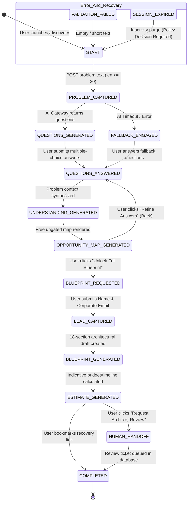

# AI Discovery State Machine Specification (Deterministic FSM)

**Document ID:** `DOC-ARCH-011`  
**Classification:** System Architecture / Phase 4 State Machine Engineering  
**Approved Decisions:** [BD-001](file:///d:/Project_website/docs/00-project/DECISION_LOG.md#dec-001), [BD-005](file:///d:/Project_website/docs/00-project/DECISION_LOG.md#dec-005), [BD-006](file:///d:/Project_website/docs/00-project/DECISION_LOG.md#dec-006), [BD-010](file:///d:/Project_website/docs/00-project/DECISION_LOG.md#dec-010), [BD-012](file:///d:/Project_website/docs/00-project/DECISION_LOG.md#dec-012), [BD-015](file:///d:/Project_website/docs/00-project/DECISION_LOG.md#dec-015)  
**Parent Framework:** [AI Architecture](file:///d:/Project_website/docs/05-architecture/10-AI-ARCHITECTURE.md) | [AI Discovery UX Flow](file:///d:/Project_website/docs/04-website/06-AI-DISCOVERY-UX-FLOW.md)  
**Status:** CANONICAL SPECIFICATION  

---

## 1. State Machine Architectural Mandate

The **AI Project Discovery Engine** is governed by a **deterministic Finite State Machine (FSM)** implemented in pure Python (`app/modules/discovery/state_machine.py`).

It guarantees:
1. **Zero Uncontrolled Agent Loops**: States progress strictly along verified guard conditions.
2. **Session Idempotency**: State transitions are atomic, preventing half-written database records or duplicated diagnostic steps.
3. **Non-Destructive Backtracking**: Users can navigate backward to previous stages to edit text or question responses without resetting generated artifacts.

---

## 2. Product / UX Stages (7) vs. Internal Engineering States (11)

A critical architectural distinction governs the discovery engine:

> **CORE PRINCIPLE: 7 User-Facing Product Stages ≠ 11 Internal Workflow States.**

The 11-state FSM is **strictly an internal backend implementation architecture concept**. The user experience strictly presents a streamlined, progressive 7-stage consultative flow as defined in [04-website/06-AI-DISCOVERY-UX-FLOW.md](file:///d:/Project_website/docs/04-website/06-AI-DISCOVERY-UX-FLOW.md) and [03-product/03-AI-DISCOVERY-PRODUCT-SPEC.md](file:///d:/Project_website/docs/03-product/03-AI-DISCOVERY-PRODUCT-SPEC.md). Users never see internal intermediate state transitions, buffering states, or fallback flips.

The exact mapping between user-facing stages and internal implementation states is codified below:

| User-Facing Product Stage | User Perspective & Experience | Mapped Internal FSM State(s) | Internal Architectural Function |
| :--- | :--- | :--- | :--- |
| **Stage 1: Problem Input** | Plain-language business friction intake | `START` `PROBLEM_CAPTURED` | Session initialized, input sanitized, regex PII scrubber applied, problem persisted to `dbo.problem_statements`. |
| **Stage 2: Clarification Questions** | Low-friction multiple-choice options | `QUESTIONS_GENERATED` `FALLBACK_ENGAGED` `QUESTIONS_ANSWERED` | Gateway generates 3–5 adaptive questions (or heuristic fallback activates); user selections recorded in `dbo.structured_contexts`. |
| **Stage 3: Structured Understanding** | Synthesized business challenge dossier | `UNDERSTANDING_GENERATED` | Pydantic model synthesizes validated operational challenge summary. |
| **Stage 4: Opportunity Map** | Real-time value matrix (100% Free & Ungated) | `OPPORTUNITY_MAP_GENERATED` | 5-category opportunity matrix rendered in browser; nodes persisted to `dbo.opportunities`. |
| **Stage 5: Solution Blueprint + Lead Gate**| Deep architecture brief & progressive unlock | `BLUEPRINT_REQUESTED` `LEAD_CAPTURED` `BLUEPRINT_GENERATED` | Lead gate modal captures Name & Email (`dbo.leads`), grants unlock, and synthesizes 18-section blueprint (`dbo.blueprint_sections`). |
| **Stage 6: Indicative Estimate** | Planning sizing range & legal notice | `ESTIMATE_GENERATED` | Algorithm calculates non-binding budget and timeline bands with mandatory disclaimer (`dbo.estimates`). |
| **Stage 7: Human Architect Bridge** | Hand-off for senior architect triage | `HUMAN_HANDOFF` `COMPLETED` | Consultation request enqueued (`dbo.review_requests`), notification task dispatched, session marked immutable. |

---

## 3. Finite State Machine Diagram

---

## 4. Comprehensive State Definitions & Transition Matrix

| State Name | Entry Guard Condition | Allowed User Triggers / Actions | Persistence & Side Effects | Next Permitted States |
| :--- | :--- | :--- | :--- | :--- |
| **`START`** | Valid session cookie issued or initialized. | Input problem text; select prompt chips. | Inserts new `DiscoverySession` into `dbo.discovery_sessions`. | `PROBLEM_CAPTURED`, `VALIDATION_FAILED` |
| **`PROBLEM_CAPTURED`** | Problem text length $\ge 20$ chars. | Awaits AI classification; can cancel/edit. | PII scrubbed; raw & sanitized text written to `dbo.problem_statements`. | `QUESTIONS_GENERATED`, `FALLBACK_ENGAGED` |
| **`QUESTIONS_GENERATED`** | Clarification questions successfully rendered. | Select radio options; submit answers; go back. | Questions cached in session state. | `QUESTIONS_ANSWERED`, `START` (Back) |
| **`FALLBACK_ENGAGED`** | External AI provider timeout ($>10$s) or 5xx error. | Select catalog-based multiple-choice options. | Flag `fallback_mode=True` logged; heuristic questions served. | `QUESTIONS_ANSWERED` |
| **`QUESTIONS_ANSWERED`**| Answers validated for all questions. | Review synthesized understanding. | Answers written to `dbo.structured_contexts`. | `UNDERSTANDING_GENERATED`, `QUESTIONS_GENERATED` (Back) |
| **`UNDERSTANDING_GENERATED`**| Core challenge and workflows synthesized. | Advance to Opportunity Map; refine inputs. | Problem context finalized. | `OPPORTUNITY_MAP_GENERATED`, `QUESTIONS_ANSWERED` (Back) |
| **`OPPORTUNITY_MAP_GENERATED`**| 5-category opportunity matrix rendered. | Inspect opportunity cards; click "Unlock Blueprint" (**100% Free & Ungated Output**). | Opportunity nodes inserted into `dbo.opportunities`. | `BLUEPRINT_REQUESTED`, `QUESTIONS_ANSWERED` (Back) |
| **`BLUEPRINT_REQUESTED`**| User initiates progression to deep outputs. | Submit Progressive Lead Gate form (Name, Email). | Lead gate modal displayed in browser. | `LEAD_CAPTURED`, `OPPORTUNITY_MAP_GENERATED` (Cancel) |
| **`LEAD_CAPTURED`** | Valid Name, Email, and legal consent submitted. | Awaits Blueprint & Estimate rendering. | Record inserted into `dbo.leads` & `dbo.lead_consents`; session unlocked. | `BLUEPRINT_GENERATED` |
| **`BLUEPRINT_GENERATED`**| Full 18-section architecture brief assembled. | Expand accordion sections; inspect tech stack. | 18 rows inserted into `dbo.blueprint_sections` with `[✦ AI Draft]` badge. | `ESTIMATE_GENERATED` |
| **`ESTIMATE_GENERATED`** | Sizing algorithm calculated budget/timeline bands. | Inspect confidence ratings; review disclaimer. | Sizing record inserted into `dbo.estimates` with mandatory disclaimer text (`BD-006`). | `HUMAN_HANDOFF`, `COMPLETED` |
| **`HUMAN_HANDOFF`** | User clicks *"Request Human Architect Review"*. | Submit notes for senior architect triage. | Triage ticket inserted into `dbo.review_requests`; background alert dispatched (`BD-010`). | `COMPLETED` |
| **`COMPLETED`** | Final review queued or diagnostic bookmarked. | Copy recovery link; exit to homepage. | Final audit state logged; session immutable. | `[*]` |

---

## 5. Backtracking & Non-Destructive Editing Rules

To prevent user frustration during long-form problem entry:
1. **Idempotent Re-synthesis**: If a user returns from `OPPORTUNITY_MAP_GENERATED` to `QUESTIONS_ANSWERED` to change an answer, the system updates `dbo.structured_contexts` without creating duplicate session rows.
2. **Progressive Unlocking Preservation**: Once a session attains `is_unlocked = True` (`LEAD_CAPTURED`), the session remains unlocked permanently. Navigating backward to edit answers will re-synthesize the Blueprint and Estimate automatically without asking for contact details a second time.
